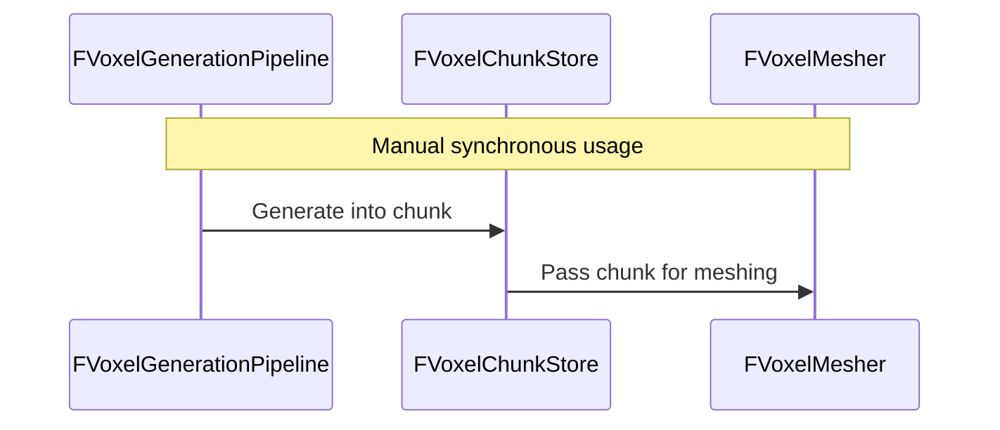
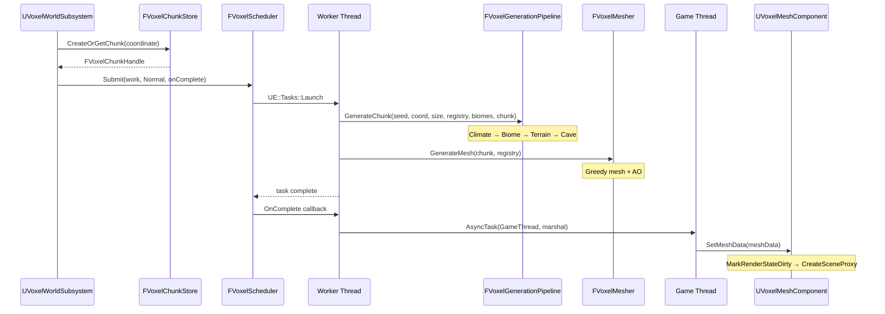

# Voxel Framework API Reference

This document provides a comprehensive reference for the Voxel Framework API, organized by module.

## VoxelCore

### FVoxelChunkCoordinate
- `X`, `Y`, `Z`: `int32`
- `ChebyshevDistanceTo(const FVoxelChunkCoordinate& Other) const -> int32`
- `operator==(const FVoxelChunkCoordinate& Other) const -> bool`
- `operator+(const FVoxelChunkCoordinate& Other) const -> FVoxelChunkCoordinate`
- `GetTypeHash(const FVoxelChunkCoordinate& Coordinate) -> uint32`

### FVoxelChunkHandle
- `Coordinate`: `FVoxelChunkCoordinate`
- `Generation`: `uint32`
- `IsValid() const -> bool`
- `operator==(const FVoxelChunkHandle& Other) const -> bool`
- `GetTypeHash(const FVoxelChunkHandle& Handle) -> uint32`

### FVoxelBlockId
- `FVoxelBlockId`: `uint16`
- `VoxelBlockId_Air`: `0`

### EVoxelJobState
- `Queued`
- `Running`
- `Completed`
- `Cancelled`

### FVoxelJobHandle
- `JobId`: `uint32`

## VoxelRuntime

### FVoxelRuntimeModule
- `Get() -> FVoxelRuntimeModule&`
- `IsAvailable() -> bool`
- `GetScheduler() -> FVoxelScheduler*`

### FVoxelScheduler
- `Submit(...) -> FVoxelJobHandle`
- `GetState(FVoxelJobHandle) -> EVoxelJobState`
- `RequestCancel(FVoxelJobHandle)`

### EVoxelWorkPriority
- `Low`
- `Normal`
- `High`
- `Critical`

### UVoxelRuntimeSettings
| Property | Type | Default | Notes |
|---|---|---|---|
| ChunkSize | int32 | 32 | |
| WorldHeightInChunks | int32 | 8 | |
| SimulationDistance | int32 | 4 | |
| RenderDistance | int32 | 8 | |
| GenerationDistance | int32 | 10 | |
| PersistenceDistance | int32 | 12 | |
| StreamingBudgetMs | float | 1.5 | |
| RenderSubmissionBudgetMs | float | 1.0 | |
| MemoryBudgetMB | int32 | 256 | |

## VoxelMath

### VoxelNoise namespace
- `Sample2D(...)`
- `Sample3D(...)`
- `FBM2D(...)`
- `FBM3D(...)`

## VoxelAssets

### UVoxelBlockDefinition
| Property | Type | Notes |
|---|---|---|
| BlockId | FVoxelBlockId | |
| DisplayName | FString | |
| bIsSolid | bool | |
| bGeneratesCollision | bool | |
| MaterialLayerIndex | int32 | |
| VertexTint | FLinearColor | |

### UVoxelBiomeDefinition
| Property | Type | Notes |
|---|---|---|
| DisplayName | FString | |
| TemperatureRange | FVector2D | |
| HumidityRange | FVector2D | |
| TerrainLayers | TArray<FVoxelTerrainLayer> | |
| AmbientTint | FLinearColor | |
| BiomeTags | FGameplayTagContainer | |
| VegetationDensity | float | |

### FVoxelTerrainLayer (USTRUCT)
| Property | Type | Notes |
|---|---|---|
| Block | TSoftObjectPtr<UVoxelBlockDefinition> | |
| ThicknessVoxels | int32 | |

### UVoxelBlockRegistry
- `BuildFromDefinitions()`
- `FindDefinition(FVoxelBlockId)`
- `IsSolid(FVoxelBlockId)`
- `PrecacheBiomeLayers()`
- `GetResolvedLayerBlockIds()`

## VoxelStorage

### FVoxelChunk
- `FVoxelChunk(int32 InSize)`
- `ResetForReuse()`
- `GetSize() const -> int32`
- `GetBlock(...) const -> FVoxelBlockId`
- `SetBlock(..., bool bIsGenerationWrite)`
- `IsEmpty() const -> bool`
- `GetModifications() -> ...`
- `ApplyModifications(...)`
- `ToLinearIndex(...) const -> int32`

### FVoxelChunkStore
- `FVoxelChunkStore(int32 InChunkSize)`
- `CreateOrGetChunk(...) -> FVoxelChunkHandle`
- `RemoveChunk(...)`
- `FindChunkByCoordinate(...) -> FVoxelChunkHandle`
- `FindChunkByHandle(...) -> const FVoxelChunk*`
- `GetLoadedChunkCount() const -> int32`
Note: Move-only.

## VoxelGeneration

### IVoxelGenerationPass
- `GetPassName() const -> FString`
- `Execute(...)`

### FVoxelGenerationContext
- `WorldSeed`
- `ChunkCoordinate`
- `ChunkSize`
- `BlockRegistry`
- `AvailableBiomes`
- `Columns`
- `InitColumns()`
- `ColumnAt(...) -> FVoxelColumnData&`
- `LocalToWorldColumn(...)`

### FVoxelColumnData
- `Temperature`
- `Humidity`
- `TerrainHeight`
- `Biome`

### FVoxelGenerationPipeline
- `FVoxelGenerationPipeline()` (default pass order)
- `GenerateChunk(seed, coord, size, registry, biomes, outChunk)`
Note: Move-only.

### Generation Passes
| Pass | Reads | Writes |
|---|---|---|
| ClimatePass | None | Temperature, Humidity |
| BiomePass | Temperature, Humidity | Biome |
| TerrainPass | Biome | TerrainHeight, blocks |
| CavePass | Blocks | Blocks (carves air) |

### Tunable Constants
- **TerrainPass**: `NoiseOctaves=4`, `BaseFrequency=0.01f`, `HeightAmplitude=40.0f`, `BaseHeight=64`
- **CavePass**: `NoiseOctaves=3`, `DensityFrequency=0.045f`, `CarveThreshold=0.58f`, `SurfaceProtectionDepth=3`

## VoxelMeshing

### FVoxelMeshVertex
- `Position`
- `Normal`
- `UV`
- `Color` (baked AO)

### FVoxelMeshSection
- `MaterialId`
- `Indices`

### FVoxelMeshData
- `Vertices`
- `Sections`
- `IsEmpty() const -> bool`
- `GetTotalTriangleCount() const -> int32`

### FVoxelMesher
- `static GenerateMesh(chunk, registry) -> FVoxelMeshData`

### VoxelMeshingService
- `RequestMeshAsync(chunk, registry, onComplete)`

## VoxelRendering

Header: `VoxelMeshComponent.h`

### UVoxelMeshComponent (UCLASS)
Parent: `UMeshComponent`, ClassGroup=`Rendering`, BlueprintSpawnableComponent.
The production rendering component. Creates a custom `FVoxelMeshSceneProxy` to render `FVoxelMeshData` on the GPU.

#### Public methods:
```cpp
void SetMeshData(FVoxelMeshData&& InMeshData);  // Takes ownership, triggers MarkRenderStateDirty → CreateSceneProxy
void ClearMeshData();                           // Clears mesh, releases GPU resources
int32 GetNumMaterials() const override;         // Returns number of sections in current mesh data
```

#### Overrides from UPrimitiveComponent:
- `CreateSceneProxy()` — creates `FVoxelMeshSceneProxy`
- `CalcBounds()` — computes from vertex positions
- `GetNumMaterials()` — section count

Header: `VoxelMeshSceneProxy.h`

### FVoxelMeshSceneProxy (FPrimitiveSceneProxy)
Custom scene proxy that uploads `FVoxelMeshData` to GPU vertex/index buffers using `FStaticMeshVertexBuffers` and `FLocalVertexFactory`. Handles:
- Vertex buffer upload via ENQUEUE_RENDER_COMMAND
- Per-section draw calls with material assignment
- Proper cleanup of GPU resources on destruction

This is the production rendering path per ADR-004 — `FVoxelMeshData` (plain CPU arrays from VoxelMeshing) is consumed here and turned into GPU-visible geometry without VoxelMeshing knowing anything about rendering.

## VoxelWorld

Header: `VoxelWorldSubsystem.h`

### UVoxelWorldSubsystem (UCLASS)
Parent: `UWorldSubsystem`
The integration point: given a chunk coordinate, produces a rendered chunk asynchronously.

#### Public methods:
```cpp
virtual void Initialize(FSubsystemCollectionBase& Collection) override;
virtual void Deinitialize() override;
virtual ~UVoxelWorldSubsystem() override;

FVoxelChunkHandle RequestChunk(const FVoxelChunkCoordinate& Coordinate);
// Reserves storage (sync, cheap), dispatches generation+meshing async.
// Idempotent — re-requesting returns existing handle, no second job.

void UnloadChunk(const FVoxelChunkCoordinate& Coordinate);
// Removes chunk storage and rendering. Does NOT cancel in-flight jobs.

const FVoxelChunk* FindChunk(const FVoxelChunkCoordinate& Coordinate) const;
// Read-only access. Returns nullptr if not requested/still generating/unloaded.

bool IsChunkReady(const FVoxelChunkCoordinate& Coordinate) const;
// True once generation completed (mesh may be empty for all-air chunks).

int32 GetChunkSize() const;
int32 GetWorldSeed() const;
```

#### Private members (for architecture understanding):
- `TUniquePtr<FVoxelChunkStore> ChunkStore`
- `TObjectPtr<UVoxelBlockRegistry> BlockRegistry`
- `TArray<TObjectPtr<UVoxelBiomeDefinition>> ResolvedBiomes`
- `TObjectPtr<AVoxelWorldRenderActor> RenderHostActor`
- `TMap<FVoxelChunkCoordinate, TWeakObjectPtr<UVoxelMeshComponent>> ChunkMeshComponents` (NOT UPROPERTY — FVoxelChunkCoordinate is plain struct)
- `TSet<FVoxelChunkCoordinate> RequestedCoordinates, ReadyCoordinates`

Thread ownership: all PUBLIC methods are Game-Thread-only. Worker thread runs generation+meshing, result marshaled back via `AsyncTask(ENamedThreads::GameThread)`.

Explicit scope boundaries (what this class does NOT do):
- Does NOT decide WHEN or WHY to request a chunk (no distance-to-player logic) — VoxelStreaming's job
- Does NOT stitch mesh seams across chunk boundaries
- Does NOT implement job cancellation for in-flight work

Header: `VoxelWorldSettings.h`

### UVoxelWorldSettings (UCLASS)
UDeveloperSettings, Project Settings → Plugins → Voxel World

| Property | Type | Default | Notes |
|---|---|---|---|
| WorldSeed | int32 | 1234 | Passed to generation pipeline |
| DefaultBiomes | TArray<TSoftObjectPtr<UVoxelBiomeDefinition>> | empty | Resolved at subsystem init |
| VoxelWorldSize | float | 100.0 | World-space size of one voxel |
| BlockMaterials | TMap<int32, TSoftObjectPtr<UMaterialInterface>> | empty | Per-block material overrides |
| DefaultMaterial | TSoftObjectPtr<UMaterialInterface> | unset | Fallback material |

Header: `AVoxelWorldRenderActor.h`

### AVoxelWorldRenderActor (UCLASS)
Parent: `AActor`, NotBlueprintable, NotPlaceable
Transient host actor spawned by `UVoxelWorldSubsystem` to hold `UVoxelMeshComponents`. Not placed by users — created/destroyed automatically with the subsystem.

## VoxelDebug

### AVoxelDebugVisualizer (UCLASS)
Parent: `AActor`

Properties: `WorldSeed`, `ChunkSize`, `ChunkRadiusXY`, `ChunkCountZ`, `VoxelWorldSize`, `BlockMaterials`, `DefaultMaterial`, `Biomes`, `bEnableCollisionInMeshPreview`

#### CallInEditor functions:
```cpp
UFUNCTION(CallInEditor, Category="Voxel Debug|Cube Preview")
void GenerateAndVisualize();           // cube-per-visible-voxel (ISMC)

UFUNCTION(CallInEditor, Category="Voxel Debug|Mesh Preview")
void GenerateAndVisualizeMeshed();     // real FVoxelMesher via PMC

UFUNCTION(CallInEditor, Category="Voxel Debug|Real Renderer Preview")
void GenerateAndVisualizeRendered();   // real UVoxelMeshComponent/FVoxelMeshSceneProxy

UFUNCTION(CallInEditor, Category="Voxel Debug|World Subsystem Test")
void RequestChunksViaSubsystem();      // async UVoxelWorldSubsystem pipeline (PIE only)

UFUNCTION(CallInEditor, Category="Voxel Debug|World Subsystem Test")
void ValidateSubsystemResults();       // per-chunk validation: readiness, retrieval, idempotency, data consistency

UFUNCTION(CallInEditor, Category="Voxel Debug")
void ClearVisualization();
```

## Cross-module data flow

### Direct / Manual Usage


### Full Async Flow (UVoxelWorldSubsystem)

