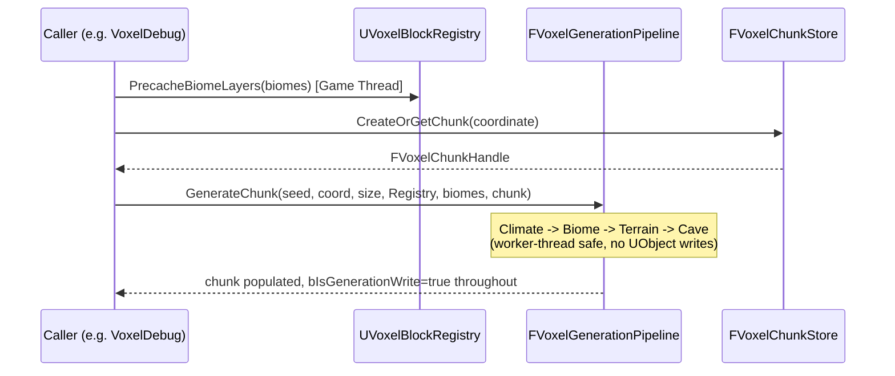

# API Reference

Every public class, struct, and function currently in the framework, grouped by module. This is a reference document, not a tutorial — see [`ARCHITECTURE.md`](ARCHITECTURE.md) for how these pieces fit together and *why* they're shaped this way.

Convention used below: `F` prefix = plain C++ struct/class, `U` = `UObject`-derived, `A` = `AActor`-derived, `I` = interface.

---

## VoxelCore

### `FVoxelChunkCoordinate` — `VoxelCoreTypes.h`
Integer chunk-space coordinate (not world-space — multiply by chunk size to get world position).

| Member | Type | Notes |
|---|---|---|
| `X`, `Y`, `Z` | `int32` | |
| `ChebyshevDistanceTo(other)` | `int32` | Max-axis distance; matches how streaming radii are specified ("N chunk radius" is a cube, not a sphere) |

### `FVoxelChunkHandle` — `VoxelCoreTypes.h`
Opaque, non-owning reference to a chunk. Never dereference storage directly across module boundaries — resolve through `FVoxelChunkStore`.

| Member | Type | Notes |
|---|---|---|
| `Coordinate` | `FVoxelChunkCoordinate` | |
| `Generation` | `uint32` | Bumped each time a pooled slot is reused; `0` means invalid |
| `IsValid()` | `bool` | `Generation != 0` |

### `FVoxelBlockId` — `VoxelCoreTypes.h`
`using FVoxelBlockId = uint16;` — bit-packed block identifier. `VoxelBlockId_Air = 0` is reserved.

### `EVoxelJobState` — `VoxelJobTypes.h`
```cpp
enum class EVoxelJobState : uint8 { Queued, Running, Completed, Cancelled };
```
`Cancelled` exists from day one; nothing sets it automatically yet — see `ARCHITECTURE.md` §6.

### `FVoxelJobHandle` — `VoxelJobTypes.h`
Opaque reference to a submitted `FVoxelScheduler` job. `JobId == 0` is invalid.

---

## VoxelRuntime

### `FVoxelRuntimeModule` — `VoxelRuntimeModule.h`
```cpp
static FVoxelRuntimeModule& Get();
static bool IsAvailable();
FVoxelScheduler& GetScheduler() const;
```
Standard module singleton pattern. Owns the one `FVoxelScheduler` instance for the process.

### `FVoxelScheduler` — `VoxelScheduler.h`
Thin wrapper over `UE::Tasks` (see `ADR-002`).

```cpp
FVoxelJobHandle Submit(TFunction<void()> Work, EVoxelWorkPriority Priority, TFunction<void()> OnComplete = nullptr);
EVoxelJobState GetState(FVoxelJobHandle Handle) const;
void RequestCancel(FVoxelJobHandle Handle);
```

- `Submit` is safe from any thread. `OnComplete` runs on the completing thread — **not** automatically marshaled to Game Thread (see `ARCHITECTURE.md` §6).
- `EVoxelWorkPriority { Low, Normal, High, Critical }` maps to `UE::Tasks::ETaskPriority` (`Critical`/`High` → `High`, `Normal` → `Normal`, `Low` → `BackgroundLow`).
- `RequestCancel` is implemented and correctly transitions state, but no current caller invokes it and no pass checks for cancellation mid-run.

### `UVoxelRuntimeSettings` — `VoxelRuntimeSettings.h`
`UDeveloperSettings`, exposed at **Project Settings → Plugins → Voxel Framework**.

| Property | Default | Notes |
|---|---|---|
| `ChunkSize` | 32 | Power of two, 8–64 |
| `WorldHeightInChunks` | 8 | |
| `SimulationDistance` | 4 | Chebyshev chunk radius, collision required |
| `RenderDistance` | 8 | Must be ≥ `SimulationDistance` |
| `GenerationDistance` | 10 | |
| `PersistenceDistance` | 12 | |
| `StreamingBudgetMs` | 1.5 | Game Thread budget |
| `RenderSubmissionBudgetMs` | 1.0 | |
| `MemoryBudgetMB` | 256 | |

**Not currently read by any code** — `VoxelGeneration`/`VoxelStorage` take chunk size as an explicit constructor argument instead, so they stay unit-testable without a full settings/subsystem stack. Wiring this up is a `VoxelStreaming`/world-subsystem task.

---

## VoxelMath

### `namespace VoxelNoise` — `VoxelNoise.h`
All functions `VOXELMATH_API`, pure, reentrant, no shared state.

```cpp
float Sample2D(int32 Seed, float X, float Y);                                    // [-1, 1]
float Sample3D(int32 Seed, float X, float Y, float Z);                           // [-1, 1]
float FractalBrownianMotion2D(int32 Seed, float X, float Y, int32 Octaves,
                               float Lacunarity = 2.0f, float Gain = 0.5f);
float FractalBrownianMotion3D(int32 Seed, float X, float Y, float Z, int32 Octaves,
                               float Lacunarity = 2.0f, float Gain = 0.5f);
```

Hash-based value noise (not Perlin/Simplex) — no permutation table, so no cache-unfriendly lookups; deliberate mobile-friendly choice. `Sample*` use smoothstep interpolation between hashed lattice corners.

---

## VoxelAssets

### `UVoxelBlockDefinition` — `VoxelBlockDefinition.h`
`UDataAsset`. One instance per block type.

| Property | Type | Notes |
|---|---|---|
| `BlockId` | `int32` | Stable ID — never reuse for a different block after ship, breaks save compatibility |
| `DisplayName` | `FText` | |
| `bIsSolid` | `bool` | Face-culling relevance |
| `bGeneratesCollision` | `bool` | |
| `MaterialLayerIndex` | `int32` | Texture atlas index, consumed by future `VoxelMeshing` |
| `VertexTint` | `FLinearColor` | |

### `UVoxelBiomeDefinition` — `VoxelBiomeDefinition.h`
`UDataAsset`.

| Property | Type | Notes |
|---|---|---|
| `DisplayName` | `FText` | |
| `TemperatureRange`, `HumidityRange` | `FVector2D` | `[0,1]`, used by `BiomePass` selection |
| `TerrainLayers` | `TArray<FVoxelTerrainLayer>` | Ordered top-down; last entry fills to bedrock |
| `AmbientTint` | `FLinearColor` | |
| `BiomeTags` | `FGameplayTagContainer` | Generic — gameplay code defines meaning |
| `VegetationDensity` | `float` | `[0,1]`, not yet consumed (no `VegetationPass` exists) |

`FVoxelTerrainLayer` = `{ TSoftObjectPtr<UVoxelBlockDefinition> Block; int32 ThicknessVoxels; }`.

### `UVoxelBlockRegistry` — `VoxelBlockRegistry.h`
`UWorldSubsystem`. The only place block/biome soft references get resolved to fast runtime data.

```cpp
void BuildFromDefinitions(const TArray<UVoxelBlockDefinition*>& Definitions);
const UVoxelBlockDefinition* FindDefinition(FVoxelBlockId BlockId) const;
bool IsSolid(FVoxelBlockId BlockId) const;

void PrecacheBiomeLayers(const TArray<UVoxelBiomeDefinition*>& Biomes);   // Game Thread ONLY
const TArray<FVoxelBlockId>* GetResolvedLayerBlockIds(const UVoxelBiomeDefinition* Biome) const; // any thread, read-only
```

`PrecacheBiomeLayers` must run before any generation job references those biomes — it calls `LoadSynchronous()` on soft pointers, which requires the Game Thread. `GetResolvedLayerBlockIds` returns `nullptr` for any biome never precached; callers must handle that (see `TerrainPass`'s fallback layering).

---

## VoxelStorage

### `FVoxelChunk` — `VoxelChunk.h`
Plain C++ (`ADR-003`). Not internally synchronized — single-writer assumption enforced by the owning system, not this class.

```cpp
explicit FVoxelChunk(int32 InSize);
void ResetForReuse();                    // clears data, keeps allocation (pooling)
int32 GetSize() const;
FVoxelBlockId GetBlock(int32 LocalX, int32 LocalY, int32 LocalZ) const;
void SetBlock(int32 LocalX, int32 LocalY, int32 LocalZ, FVoxelBlockId BlockId, bool bIsGenerationWrite);
bool IsEmpty() const;                    // true until any non-air block written
const TMap<int32, FVoxelBlockId>& GetModifications() const;  // linear index -> value, gameplay edits only
void ApplyModifications(const TMap<int32, FVoxelBlockId>& InModifications);
int32 ToLinearIndex(int32 LocalX, int32 LocalY, int32 LocalZ) const;
```

`bIsGenerationWrite=true` writes are **not** tracked in `GetModifications()` — only player/gameplay edits are, which is what makes diff-based serialization (`ADR-005`) possible.

### `FVoxelChunkStore` — `VoxelChunkStore.h`
Pooled, handle-based chunk lifecycle manager. **Game Thread only in the current implementation** — not yet thread-safe (deliberately deferred until `VoxelStreaming` needs it).

```cpp
explicit FVoxelChunkStore(int32 InChunkSize);
FVoxelChunkHandle CreateOrGetChunk(const FVoxelChunkCoordinate& Coordinate);
void RemoveChunk(const FVoxelChunkCoordinate& Coordinate);
FVoxelChunk* FindChunkByCoordinate(const FVoxelChunkCoordinate& Coordinate) const;
FVoxelChunk* FindChunkByHandle(const FVoxelChunkHandle& Handle) const;  // nullptr if stale
int32 GetLoadedChunkCount() const;
```

Move-only (explicitly deleted copy ctor/assignment — see git history for why this matters: the compiler will otherwise try to instantiate a copy operator it can't actually implement, given the internal `TUniquePtr`).

---

## VoxelGeneration

### `IVoxelGenerationPass` — `IVoxelGenerationPass.h`
```cpp
virtual const TCHAR* GetPassName() const = 0;
virtual void Execute(FVoxelGenerationContext& Context, FVoxelChunk& Chunk) = 0;
```
See `ARCHITECTURE.md` §5 for the full contract (determinism, no UObject access, world-space sampling).

### `FVoxelGenerationContext` — `VoxelGenerationContext.h`
```cpp
int32 WorldSeed;
FVoxelChunkCoordinate ChunkCoordinate;
int32 ChunkSize;
const UVoxelBlockRegistry* BlockRegistry;          // may be nullptr
TArray<const UVoxelBiomeDefinition*> AvailableBiomes;
TArray<FVoxelColumnData> Columns;                  // indexed [X + Y*ChunkSize]

void InitColumns();
FVoxelColumnData& ColumnAt(int32 LocalX, int32 LocalY);
FVector2D LocalToWorldColumn(int32 LocalX, int32 LocalY) const;
```

`FVoxelColumnData` = `{ float Temperature, Humidity; int32 TerrainHeight; const UVoxelBiomeDefinition* Biome; }`.

### `FVoxelGenerationPipeline` — `VoxelGenerationPipeline.h`
```cpp
FVoxelGenerationPipeline();  // builds default pass order: Climate, Biome, Terrain, Cave
void GenerateChunk(int32 WorldSeed, const FVoxelChunkCoordinate& Coordinate, int32 ChunkSize,
                    const UVoxelBlockRegistry* BlockRegistry,
                    const TArray<const UVoxelBiomeDefinition*>& AvailableBiomes,
                    FVoxelChunk& OutChunk) const;
```
Move-only, same reasoning as `FVoxelChunkStore`.

### Passes

| Class | Header | Reads | Writes |
|---|---|---|---|
| `FClimatePass` | `Passes/ClimatePass.h` | world XY | `Column.Temperature`, `Column.Humidity` |
| `FBiomePass` | `Passes/BiomePass.h` | `Column.Temperature/Humidity`, `Context.AvailableBiomes` | `Column.Biome` |
| `FTerrainPass` | `Passes/TerrainPass.h` | `Column.Biome`, `BlockRegistry` resolved layers | `Column.TerrainHeight`, block buffer |
| `FCavePass` | `Passes/CavePass.h` | `Column.TerrainHeight`, existing block buffer | block buffer (carves to air) |

Tunable constants (all `private static constexpr` on the pass class — change and recompile, not currently data-driven):

- `FTerrainPass`: `NoiseOctaves=4`, `BaseFrequency=0.01f`, `HeightAmplitude=40.0f`, `BaseHeight=64`
- `FCavePass`: `NoiseOctaves=3`, `DensityFrequency=0.045f`, `CarveThreshold=0.58f`, `SurfaceProtectionDepth=3`

---

## VoxelDebug

### `AVoxelDebugVisualizer` — `VoxelDebugVisualizer.h`
`AActor` (explicitly against `ADR-001` for production chunks — this is a debug-tool exception, see the header comment).

| Property | Type | Default | Notes |
|---|---|---|---|
| `WorldSeed` | `int32` | 1234 | |
| `ChunkSize` | `int32` | 32 | Independent of `UVoxelRuntimeSettings` |
| `ChunkRadiusXY` | `int32` | 2 | Chunks generated along X/Y, centered on origin |
| `ChunkCountZ` | `int32` | 3 | Chunks generated along Z, starting at 0 |
| `VoxelWorldSize` | `float` | 100.0 | UU per voxel; 100 matches engine cube mesh native size |
| `BlockMaterials` | `TMap<int32, UMaterialInterface*>` | empty | Per-block-ID color override |
| `DefaultMaterial` | `UMaterialInterface*` | none | Used for any block ID not in `BlockMaterials` |
| `Biomes` | `TArray<UVoxelBiomeDefinition*>` | empty | Leave empty to use `TerrainPass`'s flat fallback layering |

```cpp
UFUNCTION(CallInEditor) void GenerateAndVisualize();  // clears + regenerates
UFUNCTION(CallInEditor) void ClearVisualization();
```

One `UInstancedStaticMeshComponent` per distinct block ID actually placed. "Exposed voxel" culling is per-voxel (skips fully-buried voxels), **not** per-face — still one full cube per visible voxel. Not representative of final triangle counts; exists purely to validate generation output visually.

---

## Cross-module data flow summary


