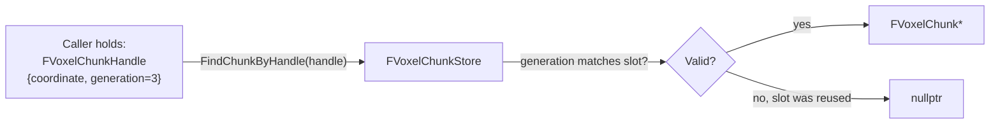
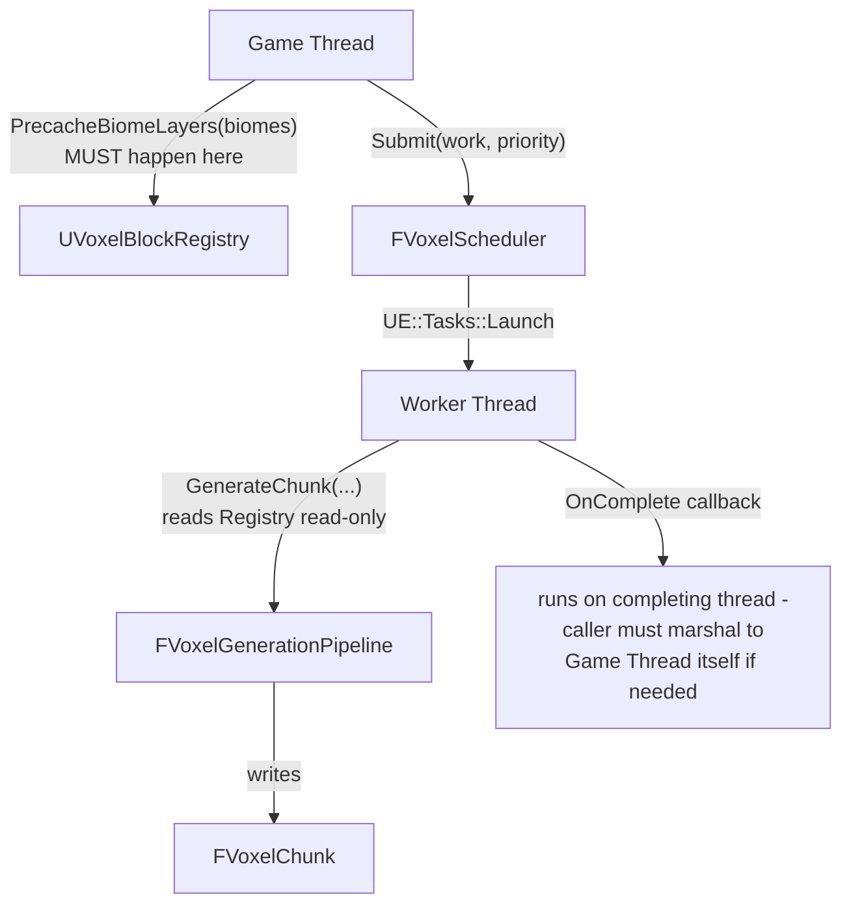

# Architecture

This document explains **how the Voxel Framework is built**, **why it's built that way**, and **how data actually moves through it**. If `README.md` is the pitch, this is the internals manual — read this before modifying any module.

Companion documents:
- [`ADR.md`](ADR.md) — the frozen decisions and the reasoning behind each one
- [`API_REFERENCE.md`](API_REFERENCE.md) — every public class/struct/function, module by module
- [`TODO.md`](../TODO.md) — what's left, in priority order

---

## 1. Design philosophy

The framework is built around one governing rule, stated in `ADR.md` and repeated here because everything else follows from it:

> **Every module answers exactly one question, and no module reaches into another module's internals.**

Concretely, this means:

- A module never includes a header from a module that (directly or transitively) depends on it. The dependency graph is a DAG, verified informally by the fact that `.Build.cs` files simply can't express a cycle without UBT erroring.
- Data crosses module boundaries as **plain structs and handles**, never as raw pointers to another module's internal state (see §4, Handles).
- Nothing assumes it's running on the Game Thread unless its doc comment says so explicitly. Most of the interesting code (generation passes, noise, storage) is worker-thread-safe by construction, not by convention.
- "It compiles" is not "it works." Every module that has meaningfully complex logic has automation tests that exercise the actual guarantee (determinism, boundary continuity, stale-handle rejection) — see §7.

---

## 2. Module map

```
VoxelCore        — leaf. types, interfaces, job state. depends on nothing but Core/CoreUObject.
VoxelRuntime      — owns UE::Tasks scheduling + Project Settings. depends on VoxelCore.
VoxelMath         — pure noise functions. depends on VoxelCore.
VoxelAssets       — block/biome data assets + registry. depends on VoxelCore.
VoxelStorage      — chunk pool + voxel buffer. depends on VoxelCore, VoxelRuntime.
VoxelGeneration   — generation pass pipeline. depends on VoxelMath, VoxelAssets, VoxelStorage, VoxelRuntime.
VoxelDebug        — cube-per-voxel preview tool. depends on VoxelGeneration, VoxelStorage, VoxelAssets.
```

Nothing above `VoxelStorage` in this list knows anything about generation, meshing, or rendering exists. `VoxelStorage` doesn't know `VoxelGeneration` exists either — generation is a *consumer* of storage, not the other way around. This is what lets `VoxelMeshing` (next module to be built) plug in without touching a single existing file: it will depend on `VoxelStorage` for chunk data and nothing else upstream needs to change.

See `README.md` for the rendered Mermaid dependency graph.

---

## 3. Why each module exists (not just what it does)

### VoxelCore
Everything else needs to talk about "a chunk coordinate" or "a job that might get cancelled" without needing to know what a chunk *is* yet. `VoxelCore` exists so those shared vocabulary types (`FVoxelChunkCoordinate`, `FVoxelChunkHandle`, `EVoxelJobState`) live in exactly one place instead of being redefined per-module or forcing an artificial dependency on whichever module happened to define them first.

### VoxelRuntime
Two unrelated-sounding things live here together deliberately: the task scheduler wrapper and Project Settings. Both are "process-wide services every other module needs but none of them should own individually." Splitting them into separate modules would be over-engineering for what's currently two small systems; if either grows significantly (e.g. the scheduler needs its own priority-inversion tests), it can be split out later without touching call sites, since everything goes through `FVoxelRuntimeModule::Get()`.

### VoxelMath
Deliberately the only module allowed to know what noise is. `VoxelStorage` explicitly does **not** depend on this (see ADR feedback in git history / `ADR.md`) — storage is "what block is where," not "why." Keeping noise isolated here means a future alternate noise implementation (simplex, Perlin with permutation tables, GPU-computed) is a drop-in replacement with zero ripple into generation logic, as long as the function signatures in `VoxelNoise.h` stay stable.

### VoxelAssets
The bridge between "designer-authored content" (data assets you create in the Content Browser) and "fast runtime lookup" (a flat array indexed by integer ID). This split exists because `TSoftObjectPtr` resolution requires the Game Thread and asset loading, which generation passes are explicitly forbidden from touching (they run on worker threads). `UVoxelBlockRegistry::PrecacheBiomeLayers` is the one-time Game-Thread bridge; everything after that is worker-thread-safe array indexing.

### VoxelStorage
The actual "world data" module. Deliberately dumb: it knows how to store, retrieve, and pool voxel buffers, and how to distinguish "generation wrote this" from "a player changed this" (for future diff-based saving). It has zero opinion on where the data came from or what it's used for next.

### VoxelGeneration
The only module that's allowed to be "smart" about *why* a voxel is what it is. Everything here follows the same pass contract (§5) so that adding River/Structure/Vegetation passes later is additive, not a rewrite.

### VoxelDebug
Exists specifically to answer "does this look right" without waiting for the real renderer. See `ADR.md` for why this is allowed to use `AActor` when nothing else in the framework is.

---

## 4. Handles: how modules reference data they don't own

A recurring pattern across the framework: instead of module A holding a raw pointer into module B's internal storage, A holds a **handle** — a small value type (coordinate + generation counter, or an opaque ID) that module B can resolve back to real data, and safely reject if stale.



Why this matters: chunks are pooled (`ADR-003`). When a chunk unloads, its pool slot gets reused for a *different* chunk later. Without the generation counter, an old raw pointer or naively-reused coordinate lookup would silently return the wrong chunk's data. With it, a stale handle fails cleanly (`nullptr`), and the caller's bug surfaces immediately instead of corrupting unrelated data.

The same pattern is used for `FVoxelJobHandle` in `VoxelRuntime` (§6) — a job ID that's safe to hold even after the job completes or is cancelled.

---

## 5. The generation pass contract

Every pass in `VoxelGeneration/Passes/` implements `IVoxelGenerationPass`:

```cpp
virtual void Execute(FVoxelGenerationContext& Context, FVoxelChunk& Chunk) = 0;
```

And every pass, without exception, follows these rules:

1. **No `UObject` access beyond read-only, already-resolved data.** A pass may read `Context.BlockRegistry->GetResolvedLayerBlockIds(...)` (a plain `TArray` lookup) but must never call `LoadSynchronous()`, spawn actors, or touch anything requiring the Game Thread.
2. **Deterministic.** Same `(WorldSeed, ChunkCoordinate)` in ⇒ identical `FVoxelChunk` contents out, every time, forever. This is what makes diff-based serialization possible (`ADR-005`) — if generation weren't deterministic, every chunk would need full serialization instead of just player edits.
3. **World-space sampling, not chunk-local.** Every pass samples noise using **world** coordinates (`Context.LocalToWorldColumn`), never chunk-local ones. This is *why* chunk boundaries are continuous — two adjacent chunks sampling the same continuous noise field at adjacent world coordinates naturally produce correlated results. There is no special "stitching" step; continuity is a side effect of correct sampling, not a separate system.
4. **Pipeline order is fixed and explicit**, defined once in `FVoxelGenerationPipeline`'s constructor:


   `Climate` before `Biome` (biome selection needs temperature/humidity). `Biome` before `Terrain` (terrain needs a resolved layer list). `Terrain` before `Cave` (cave carves through blocks that must already exist). This ordering is documented as a comment directly above the pass list in `VoxelGenerationPipeline.cpp` — check there before reordering anything.
5. **Passes communicate through `FVoxelGenerationContext`, never directly with each other.** `ClimatePass` has no idea `BiomePass` exists; it just writes `Column.Temperature`/`Column.Humidity`. This is what makes each pass independently testable (see the manual pass-assembly pattern in `VoxelCavePassTests.cpp`'s `SurfaceProtected` test).

### Column-major intermediate data

`FVoxelGenerationContext::Columns` is a flat array of one `FVoxelColumnData` per `(X,Y)` column in the chunk, shared by every pass. This exists because several values (temperature, humidity, terrain height, selected biome) are naturally 2D — computed once per column, then read by every Z-level in that column. Passes that need this data call `Context.ColumnAt(LocalX, LocalY)`; it's populated left-to-right by earlier passes and read-only by later ones within a single `Execute` call, though nothing currently enforces that read-only-ness at the type level — treat it as a contract, not a guarantee.

---

## 6. Threading model



Two hard rules, both stated in `ADR.md`:

- **Everything expensive is dispatched through `FVoxelScheduler`** (which wraps `UE::Tasks`), never a hand-rolled thread or raw `AsyncTask` call scattered through the codebase. This keeps priority semantics (`EVoxelWorkPriority::Low/Normal/High/Critical`) consistent everywhere work is submitted.
- **`FVoxelScheduler::Submit`'s `OnComplete` callback runs on whatever thread the task finishes on** — it does *not* automatically marshal to the Game Thread. Callers that need Game Thread affinity (almost everyone touching UObjects) must wrap their own callback in `AsyncTask(ENamedThreads::GameThread, ...)`. This is a deliberate minimal-API choice: `FVoxelScheduler` doesn't guess what a caller needs.

### Cancellation (designed in, not yet wired up)

`EVoxelJobState` includes a `Cancelled` value from day one, and `FVoxelScheduler::RequestCancel` exists and correctly transitions state — but **nothing calls it yet**, and no long-running pass currently checks for it mid-execution. This is intentional (see `ADR.md`, "Scheduler cancellation stance"): the data model exists so `VoxelStreaming` can wire up real cancellation later (e.g. "player ran away, stop generating this chunk") without changing `FVoxelScheduler`'s public API or any code that already switches on `EVoxelJobState`.

---

## 7. Automation testing strategy

Every module with non-trivial logic has tests under `Source/<Module>/Private/Tests/`, following a few consistent patterns worth understanding before adding more:

**Determinism via full-chunk hashing.** Rather than spot-checking a few voxels, `Voxel.Generation.Cave.DeterministicHash` CRC32s the entire block buffer. This catches regressions a spot-check would miss (e.g. a bug that only manifests at specific coordinates).

**Correlation, not equality, for boundary continuity.** `Voxel.Generation.Cave.BoundaryContinuity` doesn't assert two adjacent chunks are identical at the seam — they legitimately aren't, one voxel apart. It asserts a >75% solid/air match ratio, which is well above the ~50% you'd get from independent random data (a proxy for "chunk-local noise sampling snuck back in") and well below "always identical" (which noise-based terrain shouldn't produce anyway).

**Manual pass assembly for context-dependent tests.** `Voxel.Generation.Cave.SurfaceProtected` doesn't use `FVoxelGenerationPipeline` directly — it constructs `FVoxelGenerationContext` by hand and runs `ClimatePass → BiomePass → TerrainPass` itself, first as a cheap **probe** to learn the real terrain height at a known column, then regenerates at the correct chunk Z-coordinate that's mathematically guaranteed to bracket the surface. (Earlier iterations of this test guessed a fixed Z coordinate and were flaky — see the file's own comments for the full story; it's a useful cautionary example of how "looks reasonable" test data can silently depend on luck.)

**Logged, not gated, for anything without a real baseline yet.** `Voxel.Generation.PerfLog` and part of `Voxel.Generation.Cave.AirRatioLogged` intentionally don't assert tight bounds — they log via `AddInfo` so the numbers are visible in every run, with a comment explaining exactly what real threshold would require (a profiled on-device baseline) that doesn't exist yet. Don't tighten these into hard assertions without that baseline; a made-up threshold is worse than no threshold.

---

## 8. What's deliberately not built yet

Worth stating explicitly so nobody mistakes an absence for an oversight:

- **No `VoxelWorldSubsystem`.** Nothing currently calls `PrecacheBiomeLayers` or dispatches generation through `FVoxelScheduler` automatically — every caller (including `VoxelDebug`) does this by hand. This is the first thing `VoxelStreaming`/a world subsystem needs to own.
- **No River/Structure/Vegetation passes.** Not stubbed, not scaffolded — genuinely absent from `FVoxelGenerationPipeline`'s constructor, so nothing pretends to run them.
- **No meshing or rendering.** `VoxelDebug` exists specifically so this gap doesn't block validating whether generation *looks* right.
- **No serialization.** `FVoxelChunk::GetModifications()` already tracks the diff data `VoxelSerialization` will need — the data model is ready, the module isn't built.

See `TODO.md` for the prioritized version of this list.
