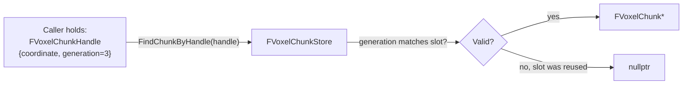
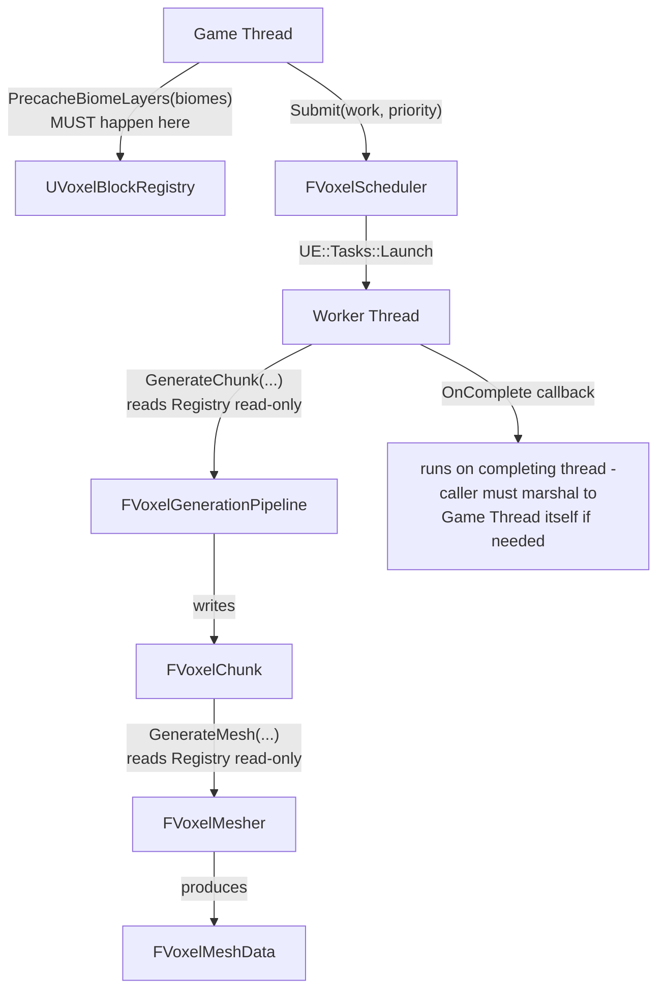
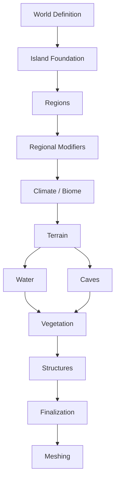

# Architecture

This document explains **how the Voxel Framework is built**, **why it's built that way**, and **how data actually moves through it**. If `README.md` is the pitch, this is the internals manual — read this before modifying any module.

Companion documents:
- [`ADR.md`](ADR.md) — the frozen decisions and the reasoning behind each one
- [`API_REFERENCE.md`](API_REFERENCE.md) — every public class/struct/function, module by module
- [`TODO.md`](../TODO.md) — what's left, in priority order

> **Currently past VoxelWorld (complete, tested, visually validated via `AVoxelDebugVisualizer`'s subsystem integration test) — see §8 for the still-open World/Game Design checkpoint on Region/Island systems, which does not block VoxelStreaming.**

---

## 1. Design philosophy

The framework is built around one governing rule, stated in `ADR.md` and repeated here because everything else follows from it:

> **Every module answers exactly one question, and no module reaches into another module's internals.**

Concretely, this means:

- A module never includes a header from a module that (directly or transitively) depends on it.
- Data crosses module boundaries as **plain structs and handles**, never as raw pointers to another module's internal state (see §4, Handles).
- Nothing assumes it's running on the Game Thread unless its doc comment says so explicitly. Most of the interesting code (generation passes, noise, storage, meshing) is worker-thread-safe by construction, not by convention.
- "It compiles" is not "it works," and "tests pass" is not "it looks right." Every module with meaningfully complex logic has automation tests exercising the actual guarantee, AND — for anything with a visual output (generation, meshing) — an actual look via `VoxelDebug` before being considered done. See §7.

---

## 2. Module map

```
VoxelCore        — leaf. types, interfaces, job state. depends on nothing but Core/CoreUObject.
VoxelRuntime      — owns UE::Tasks scheduling + Project Settings. depends on VoxelCore.
VoxelMath         — pure noise functions. depends on VoxelCore.
VoxelAssets       — block/biome data assets + registry. depends on VoxelCore.
VoxelStorage      — chunk pool + voxel buffer. depends on VoxelCore, VoxelRuntime.
VoxelGeneration   — generation pass pipeline. depends on VoxelMath, VoxelAssets, VoxelStorage, VoxelRuntime.
VoxelMeshing      — greedy meshing + AO. depends on VoxelStorage, VoxelAssets, VoxelRuntime.
VoxelRendering    — custom UMeshComponent + FPrimitiveSceneProxy. depends on VoxelMeshing.
VoxelWorld        — async world subsystem. depends on VoxelCore, VoxelRuntime, VoxelAssets, VoxelStorage, VoxelGeneration, VoxelMeshing, VoxelRendering.
VoxelDebug        — 5-mode preview tool. depends on VoxelGeneration, VoxelMeshing, VoxelStorage, VoxelAssets, VoxelRendering, VoxelWorld.
```

Nothing above `VoxelStorage` in this list knows anything about generation, meshing, or rendering exists. `VoxelStorage` doesn't know `VoxelGeneration` or `VoxelMeshing` exist either — both are *consumers* of storage. Critically, **`VoxelMeshing` does not depend on `VoxelGeneration`** — it only needs a finished `FVoxelChunk`, regardless of how that chunk's contents were produced. This is what makes the ADR-004 separation real rather than aspirational: you could hand `FVoxelMesher::GenerateMesh` a hand-authored chunk (as several automation tests do) and it works identically.

**`VoxelRendering` does not depend on `VoxelGeneration`** either — it only needs `FVoxelMeshData` (plain CPU arrays from `VoxelMeshing`). **`VoxelWorld`** is the integration point that ties all layers together: it owns `FVoxelChunkStore`, dispatches generation+meshing to worker threads via `FVoxelScheduler`, and marshals results back to the Game Thread to create `UVoxelMeshComponent` instances.

See `README.md` for the rendered Mermaid dependency graph.

---

## 3. Why each module exists (not just what it does)

### VoxelCore
Everything else needs to talk about "a chunk coordinate" or "a job that might get cancelled" without needing to know what a chunk *is* yet. `VoxelCore` exists so those shared vocabulary types live in exactly one place.

### VoxelRuntime
The task scheduler wrapper and Project Settings — "process-wide services every other module needs but none of them should own individually."

### VoxelMath
Deliberately the only module allowed to know what noise is. `VoxelStorage` explicitly does **not** depend on this.

### VoxelAssets
The bridge between "designer-authored content" and "fast runtime lookup." `UVoxelBlockRegistry::PrecacheBiomeLayers` is the one-time Game-Thread bridge; everything after that is worker-thread-safe array indexing — a pattern both `VoxelGeneration` and `VoxelMeshing` rely on (meshing uses `FindDefinition` for material/tint resolution, the same read-only registry).

### VoxelStorage
The actual "world data" module. Deliberately dumb. Zero opinion on where the data came from or what happens to it next — meshing reads it the same way generation writes it, through the same plain `GetBlock`/`SetBlock` interface.

### VoxelGeneration
The only module that's allowed to be "smart" about *why* a voxel is what it is.

### VoxelMeshing
The only module that's allowed to be "smart" about *how to draw* what's there — and nothing more. It doesn't know what a biome is, what a cave is, or that regions might exist someday. Its contract is exactly `FVoxelChunk → FVoxelMeshData`, proven literally true by the fact that its automation tests construct chunks by hand (`Chunk.SetBlock(...)`) with zero involvement from `VoxelGeneration` at all. This is where ADR-004's "meshing and rendering are separate" half also got proven, not just declared: `FVoxelMeshData` is genuinely renderer-agnostic plain data, and the debug tool's `UProceduralMeshComponent` consumption of it (an explicit, documented exception — see §6) demonstrates that any consumer can sit on top without `VoxelMeshing` itself changing.

### VoxelRendering
The production rendering path per ADR-004. `UVoxelMeshComponent` creates a custom `FVoxelMeshSceneProxy` that uploads `FVoxelMeshData` to GPU vertex/index buffers. Knows nothing about generation, biomes, or chunks — only plain mesh data.

### VoxelWorld
The integration point. `UVoxelWorldSubsystem` owns the real `FVoxelChunkStore`, calls `UVoxelBlockRegistry::PrecacheBiomeLayers` once at initialize, and dispatches generation+meshing through `FVoxelScheduler` rather than synchronous calls. This is the piece `VoxelDebug` previously faked by hand — now built, tested, and visually validated.

### VoxelDebug
Exists specifically to answer "does this look right" — now covering five modes: cube preview (ISMC), PMC mesh preview, real renderer preview (UVoxelMeshComponent), async subsystem round-trip test, and per-chunk validation with Output Log PASS/FAIL. See §6 for why `UProceduralMeshComponent` is allowed here specifically.

---

## 4. Handles: how modules reference data they don't own

A recurring pattern: instead of module A holding a raw pointer into module B's internal storage, A holds a **handle** — a small value type that module B can resolve back to real data, and safely reject if stale.



Why this matters: chunks are pooled (`ADR-003`). Without the generation counter, a stale reference could silently return the wrong chunk's data.

The same reasoning shows up in `VoxelMeshingService::RequestMeshAsync`, which takes a raw `FVoxelChunk*` rather than a handle — and is explicitly documented as an interim gap: nothing yet guarantees the chunk outlives the dispatched job, because no owning/ref-counted chunk lifetime system exists until `VoxelWorldSubsystem` is built. This is called out directly in the header rather than papered over.

---

## 5. The generation pass contract

Every pass in `VoxelGeneration/Passes/` implements `IVoxelGenerationPass`, follows a fixed pipeline order (`Climate → Biome → Terrain → Cave`), and must be deterministic and worker-thread-safe. See `API_REFERENCE.md` for the full method signatures.

`FVoxelMesher` follows an analogous but simpler contract — see §5.1.

### 5.1. The meshing contract

`FVoxelMesher::GenerateMesh(const FVoxelChunk&, const UVoxelBlockRegistry*)`:

1. **No `UObject` writes, no Game Thread requirement** — the optional registry is read-only lookups into an already-precached table.
2. **Deterministic.** Same chunk contents in ⇒ identical `FVoxelMeshData` out (vertex order included) — verified by `Voxel.Meshing.DeterministicOutput`.
3. **Pure function of its chunk, nothing else.** No coordinate, no seed, no context object — meshing doesn't need to know *why* a voxel is solid, only *that* it is. This is the concrete proof that ADR-004's module split is real.
4. **Hidden-face removal and greedy merging happen in one pass** — see `VoxelMesher.cpp`'s own extensive header comment for the algorithm.
5. **AO is computed per-vertex, independent of merge size** — deliberately NOT part of the merge key, so real terrain still merges well.

**A worked debugging example worth knowing about:** the first version of the AO automation test built a single-voxel-tall "wall" next to a "floor" voxel to check corner darkening — but the wall's own top face was *also* exposed to air, same material, and coplanar with the floor's top face, so greedy meshing correctly merged them into one bigger quad, eating the exact corner vertex the test was trying to inspect. The mesher was right; the test's scene design was wrong. Fixed by making the wall two voxels tall so its own top face sits at a different height. **Greedy meshing being "too correct" can break naive hand-built test scenes** — worth remembering when writing more meshing tests later.

---

## 6. The `VoxelDebug` UProceduralMeshComponent exception

`ADR-004` says meshing and rendering are separate modules, and — by extension — that `VoxelMeshing` itself must never import rendering types. That rule is intact: `VoxelMeshing` has zero dependency on `ProceduralMeshComponent` or any RHI/RenderCore module.

`VoxelDebug`, however, **does** depend on `ProceduralMeshComponent`, specifically to convert real `FVoxelMesher` output into something visible before `VoxelRendering` exists. This is a deliberate, narrow, documented exception:

- It exists **only** in `VoxelDebug`, never in `VoxelMeshing` or any lower-level module.
- It is explicitly *not* a preview of what the real renderer will look like performance-wise — `UProceduralMeshComponent` has known overhead the custom `FPrimitiveSceneProxy` path in `VoxelRendering` is specifically designed to avoid.
- Its purpose is narrowly "does the *geometry* look right" — not "is this fast enough."

This mirrors `AVoxelDebugVisualizer` being an `AActor` (against ADR-001) for the cube-preview mode: a debug tool answering a real question cheaply is a legitimate, bounded exception to a production rule, as long as it's documented and doesn't leak into the modules the rule actually governs.

**What this debugging pass actually found**, for the record: greedy merging visibly reduces geometry (large flat quads, not a sea of unit cubes), no obvious winding/normal defects, no visible chunk-seam cracks in the tested view. One loose end: the throwaway debug material used to view baked AO produced an unexpected glowing/emissive look rather than subtle grayscale shading — almost certainly a material node wired to Emissive instead of Base Color in that specific throwaway asset, not a defect in the baked AO data (the automation test's exact numeric match already confirms the underlying math). Not chased further, since the automation test is the thing that actually matters here and a correct production material is `VoxelRendering`'s job anyway.

---

## 7. Threading model



Two hard rules, both stated in `ADR.md`:

- **Everything expensive is dispatched through `FVoxelScheduler`**, never a hand-rolled thread. `VoxelMeshingService::RequestMeshAsync` follows this exactly — a thin pass-through, not a new abstraction.
- **`OnComplete` callbacks run on whatever thread the task finishes on** — not automatically marshaled to Game Thread.

### Cancellation (designed in, not yet wired up)

Still true for meshing as it was for generation: nothing currently cancels an in-flight mesh job. The data model (`EVoxelJobState`) supports it whenever `VoxelStreaming` needs it.

---

## 8. Design checkpoint — World/Game Design (frozen pending decisions)

**Status: `VoxelRendering` and `VoxelWorld` complete, unaffected by this checkpoint exactly as predicted. Still open for anything touching Regions/Island Foundation.**

The project's scope has clarified since Phase 0: this is a **reusable framework whose first production customer is a specific game**, not a generic infinite-world voxel engine.

- The game targets a **finite, large procedural island** — driven by high-level parameters, not hardcoded locations.
- The island contains **Regions** — logical identity/history areas, explicitly **not** synonymous with biomes.
- **Handcrafted content** must be able to reserve space that procedural generation blends around.
- Progression is **chapter-based**.
- The intended generation pipeline shape (future, not yet implemented):



  Everything from `Climate / Biome` through `Meshing` already exists and matches this shape. `World Definition → Island Foundation → Regions → Regional Modifiers` and `Water`/`Structures`/`Vegetation`/`Finalization` are the acknowledged gaps.

### Architecture impact analysis

- **No conflict** with ADR-001 through ADR-005, or any existing type — confirmed in practice now that `VoxelMeshing` shipped clean, exactly as the analysis predicted.
- **One real open architectural question**, unchanged since the checkpoint opened: region/island data is inherently **global**, not derivable from a single chunk's coordinate. Needs a precomputed, read-only structure, same pattern as `UVoxelBlockRegistry::PrecacheBiomeLayers` at world scale. **Should become its own ADR (ADR-006) before any region code is written.**
- **One open question for `VoxelSerialization`** (not started, not urgent): reserved/handcrafted content representation.
- `UVoxelRuntimeSettings` is the wrong place for per-world island parameters — not blocking anything before `VoxelWorldSubsystem` work starts.

### What's still correct to build right now

**`VoxelStreaming` is next**, unaffected by any of the above — same reasoning that correctly predicted `VoxelMeshing`, `VoxelRendering`, and `VoxelWorld` would be unaffected. Its contract ("decide which chunks to load/unload based on player position") has zero knowledge of regions or story content.

## 9. What's deliberately not built yet

- **No `VoxelStreaming`.** No distance-to-player logic, no automatic chunk loading/unloading. `UVoxelWorldSubsystem::RequestChunk` is called externally.
- **No River/Structure/Vegetation passes.**
- **No cross-chunk mesh stitching.** `FVoxelMesher` treats chunk edges as facing air unconditionally — a real gap once multiple chunks render adjacently, explicitly deferred to `VoxelStreaming`.
- **No vertex deduplication in meshing output.** Correct, not maximally memory-efficient.
- **No serialization.**
- **No job cancellation wired up.** `EVoxelJobState::Cancelled` and `FVoxelScheduler::RequestCancel` exist but nothing invokes them yet — deferred to `VoxelStreaming`.

See `TODO.md` for the prioritized version of this list.
