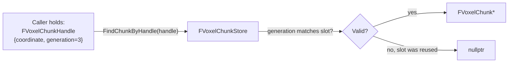
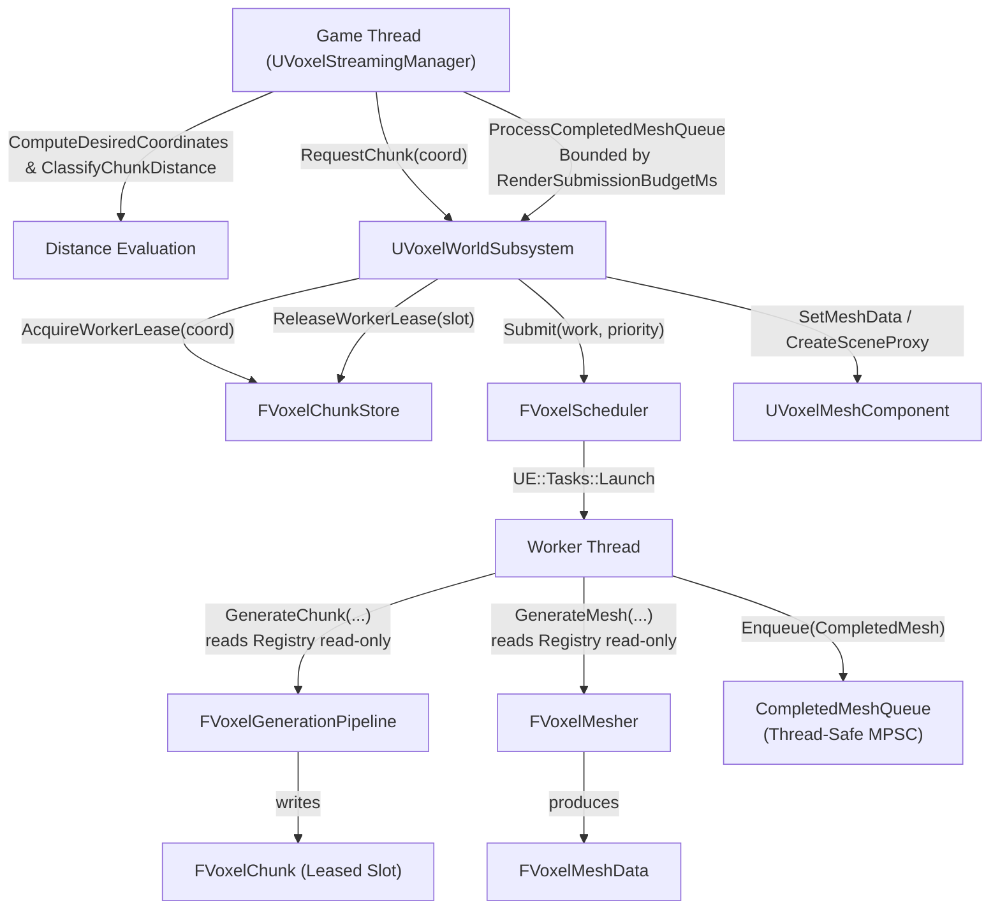

# Architecture

This document explains **how the Voxel Framework is built**, **why it's built that way**, and **how data actually moves through it**. If `README.md` is the pitch, this is the internals manual — read this before modifying any module.

Companion documents:
- [`ADR.md`](ADR.md) — the frozen decisions and the reasoning behind each one
- [`API_REFERENCE.md`](API_REFERENCE.md) — every public class/struct/function, module by module
- [`TODO.md`](../TODO.md) — what's left, in priority order

> **Currently past VoxelWorld (complete, tested, visually validated via `AVoxelDebugVisualizer`'s subsystem integration test) — see §8 for the still-open World/Game Design checkpoint on Region/Island systems, which does not block VoxelStreaming.**

---

## 1. Design philosophy

The framework is built around one governing rule, stated in `ADR.md` and repeated here because everything else follows from it:

> **Every module answers exactly one question, and no module reaches into another module's internals.**

Concretely, this means:

- A module never includes a header from a module that (directly or transitively) depends on it.
- Data crosses module boundaries as **plain structs and handles**, never as raw pointers to another module's internal state (see §4, Handles).
- Nothing assumes it's running on the Game Thread unless its doc comment says so explicitly. Most of the interesting code (generation passes, noise, storage, meshing) is worker-thread-safe by construction, not by convention.
- "It compiles" is not "it works," and "tests pass" is not "it looks right." Every module with meaningfully complex logic has automation tests exercising the actual guarantee, AND — for anything with a visual output (generation, meshing) — an actual look via `VoxelDebug` before being considered done. See §7.

---

## 2. Module map

```
VoxelCore        — leaf. types, interfaces, job state. depends on nothing but Core/CoreUObject.
VoxelRuntime      — owns UE::Tasks scheduling + Project Settings. depends on VoxelCore.
VoxelMath         — pure noise functions. depends on VoxelCore.
VoxelAssets       — block/biome data assets + registry. depends on VoxelCore.
VoxelStorage      — chunk pool + voxel buffer. depends on VoxelCore, VoxelRuntime.
VoxelGeneration   — generation pass pipeline. depends on VoxelMath, VoxelAssets, VoxelStorage, VoxelRuntime.
VoxelMeshing      — greedy meshing + AO. depends on VoxelStorage, VoxelAssets, VoxelRuntime.
VoxelRendering    — custom UMeshComponent + FPrimitiveSceneProxy. depends on VoxelMeshing.
VoxelPhysics      — collision builder + UVoxelCollisionComponent + Chaos cooking. depends on VoxelCore, VoxelStorage, VoxelAssets, VoxelRuntime.
VoxelWorld        — async world subsystem. depends on VoxelCore, VoxelRuntime, VoxelAssets, VoxelStorage, VoxelGeneration, VoxelMeshing, VoxelRendering, VoxelPhysics.
VoxelStreaming    — 4-band distance manager + adaptive frame budget. depends on VoxelCore, VoxelRuntime, VoxelWorld.
VoxelDebug        — 5-mode preview tool + 10 Hz live HUD telemetry. depends on all runtime modules.
```

Nothing above `VoxelStorage` in this list knows anything about generation, meshing, rendering, or physics. `VoxelStorage` doesn't know `VoxelGeneration`, `VoxelMeshing`, or `VoxelPhysics` exist either — all are *consumers* of storage. Critically, **`VoxelMeshing` and `VoxelPhysics` do not depend on `VoxelGeneration`** — they only need a finished `FVoxelChunk`.

**`VoxelRendering` and `VoxelPhysics` are completely decoupled from each other** per ADR-006:
- `VoxelRendering` produces GPU scene proxies for visual rendering up to `RenderDistance`.
- `VoxelPhysics` produces Chaos physics bodies for character collisions up to `SimulationDistance`.

**`VoxelWorld`** is the integration point that ties all layers together: it owns `FVoxelChunkStore`, dispatches generation, meshing, and collision to worker threads via `FVoxelScheduler`, and marshals results back to the Game Thread to create `UVoxelMeshComponent` and `UVoxelCollisionComponent` instances.

See `README.md` for the rendered Mermaid dependency graph.

---

## 3. Why each module exists (not just what it does)

### VoxelCore
Everything else needs to talk about "a chunk coordinate" or "a job that might get cancelled" without needing to know what a chunk *is* yet. `VoxelCore` exists so those shared vocabulary types live in exactly one place.

### VoxelRuntime
The task scheduler wrapper and Project Settings — "process-wide services every other module needs but none of them should own individually."

### VoxelMath
Deliberately the only module allowed to know what noise is. `VoxelStorage` explicitly does **not** depend on this.

### VoxelAssets
The bridge between "designer-authored content" and "fast runtime lookup." `UVoxelBlockRegistry::PrecacheBiomeLayers` is the one-time Game-Thread bridge; everything after that is worker-thread-safe array indexing — a pattern `VoxelGeneration`, `VoxelMeshing`, and `VoxelPhysics` rely on.

### VoxelStorage
The actual "world data" module. Deliberately dumb. Zero opinion on where the data came from or what happens to it next — meshing and collision read it through the same plain `GetBlock` interface.

### VoxelGeneration
The only module that's allowed to be "smart" about *why* a voxel is what it is.

### VoxelMeshing
The only module that's allowed to be "smart" about *how to draw* what's there — and nothing more. Its contract is exactly `FVoxelChunk → FVoxelMeshData`.

### VoxelRendering
The production rendering path per ADR-004. `UVoxelMeshComponent` creates a custom `FVoxelMeshSceneProxy` that uploads `FVoxelMeshData` to GPU vertex/index buffers. Knows nothing about physics, generation, or biomes.

### VoxelPhysics
The production collision path per ADR-006. `FVoxelCollisionBuilder` builds an immutable `FVoxelCollisionData` snapshot on worker threads (filtering non-collidable blocks), and `UVoxelCollisionComponent` implements `IInterface_CollisionDataProvider` to cook Chaos physics meshes asynchronously off the Game Thread.

### VoxelWorld
The integration point. `UVoxelWorldSubsystem` owns the real `FVoxelChunkStore`, dispatches generation, meshing, and collision through `FVoxelScheduler`, manages completion queues, worker leases, and pooled visual components.

### VoxelStreaming
The distance-driven scheduler. Runs on Game Thread Tick, evaluates 4 distance bands (`Simulation`, `Render`, `Generation`, `Persistence`), and requests/unloads chunks and collision within adaptive frame time budgets.

### VoxelDebug
Exists specifically to answer "does this look right and perform within budget" — covering five preview modes and real-time on-screen telemetry.

---

## 4. Handles: how modules reference data they don't own

A recurring pattern: instead of module A holding a raw pointer into module B's internal storage, A holds a **handle** — a small value type that module B can resolve back to real data, and safely reject if stale.



Why this matters: chunks are pooled (`ADR-003`). Without the generation counter, a stale reference could silently return the wrong chunk's data.

The same reasoning shows up in `VoxelMeshingService::RequestMeshAsync`, which takes a raw `FVoxelChunk*` rather than a handle — and is explicitly documented as an interim gap: nothing yet guarantees the chunk outlives the dispatched job, because no owning/ref-counted chunk lifetime system exists until `VoxelWorldSubsystem` is built. This is called out directly in the header rather than papered over.

---

## 5. The generation pass contract

Every pass in `VoxelGeneration/Passes/` implements `IVoxelGenerationPass`, follows a fixed pipeline order (`Climate → Biome → Terrain → Cave`), and must be deterministic and worker-thread-safe. See `API_REFERENCE.md` for the full method signatures.

`FVoxelMesher` follows an analogous but simpler contract — see §5.1.

### 5.1. The meshing contract

`FVoxelMesher::GenerateMesh(const FVoxelChunk&, const UVoxelBlockRegistry*)`:

1. **No `UObject` writes, no Game Thread requirement** — the optional registry is read-only lookups into an already-precached table.
2. **Deterministic.** Same chunk contents in ⇒ identical `FVoxelMeshData` out (vertex order included) — verified by `Voxel.Meshing.DeterministicOutput`.
3. **Pure function of its chunk, nothing else.** No coordinate, no seed, no context object — meshing doesn't need to know *why* a voxel is solid, only *that* it is. This is the concrete proof that ADR-004's module split is real.
4. **Hidden-face removal and greedy merging happen in one pass** — see `VoxelMesher.cpp`'s own extensive header comment for the algorithm.
5. **AO is computed per-vertex, independent of merge size** — deliberately NOT part of the merge key, so real terrain still merges well.

**A worked debugging example worth knowing about:** the first version of the AO automation test built a single-voxel-tall "wall" next to a "floor" voxel to check corner darkening — but the wall's own top face was *also* exposed to air, same material, and coplanar with the floor's top face, so greedy meshing correctly merged them into one bigger quad, eating the exact corner vertex the test was trying to inspect. The mesher was right; the test's scene design was wrong. Fixed by making the wall two voxels tall so its own top face sits at a different height. **Greedy meshing being "too correct" can break naive hand-built test scenes** — worth remembering when writing more meshing tests later.

---

## 6. The `VoxelDebug` UProceduralMeshComponent exception

`ADR-004` says meshing and rendering are separate modules, and — by extension — that `VoxelMeshing` itself must never import rendering types. That rule is intact: `VoxelMeshing` has zero dependency on `ProceduralMeshComponent` or any RHI/RenderCore module.

`VoxelDebug`, however, **does** depend on `ProceduralMeshComponent`, specifically to convert real `FVoxelMesher` output into something visible before `VoxelRendering` exists. This is a deliberate, narrow, documented exception:

- It exists **only** in `VoxelDebug`, never in `VoxelMeshing` or any lower-level module.
- It is explicitly *not* a preview of what the real renderer will look like performance-wise — `UProceduralMeshComponent` has known overhead the custom `FPrimitiveSceneProxy` path in `VoxelRendering` is specifically designed to avoid.
- Its purpose is narrowly "does the *geometry* look right" — not "is this fast enough."

This mirrors `AVoxelDebugVisualizer` being an `AActor` (against ADR-001) for the cube-preview mode: a debug tool answering a real question cheaply is a legitimate, bounded exception to a production rule, as long as it's documented and doesn't leak into the modules the rule actually governs.

**What this debugging pass actually found**, for the record: greedy merging visibly reduces geometry (large flat quads, not a sea of unit cubes), no obvious winding/normal defects, no visible chunk-seam cracks in the tested view. One loose end: the throwaway debug material used to view baked AO produced an unexpected glowing/emissive look rather than subtle grayscale shading — almost certainly a material node wired to Emissive instead of Base Color in that specific throwaway asset, not a defect in the baked AO data (the automation test's exact numeric match already confirms the underlying math). Not chased further, since the automation test is the thing that actually matters here and a correct production material is `VoxelRendering`'s job anyway.

---

## 7. Threading & Finalization Model



### Key Concurrency & Performance Invariants:
1. **Asynchronous Worker Lease (`AcquireWorkerLease` / `ReleaseWorkerLease`)**:
   - `FVoxelChunkStore` tracks active worker references per slot (`InFlightWorkers`).
   - If `UnloadChunk` is called while generation/meshing is active, the slot is unlinked from coordinates but **never recycled to `FreeSlotIndices`** until `InFlightWorkers == 0`. This completely eliminates use-after-free and data race corruption on pooled chunks.
2. **Authoritative State Machine (`EVoxelChunkState`)**:
   - `Unloaded → Queued → Generating → Meshing → PendingFinalize → Ready`.
   - `UnloadRequested → Unloading → (Worker finishes) → Unloaded`.
3. **Budget-Limited Game Thread Finalization Queue**:
   - Instead of burst-firing `AsyncTask(GameThread)` directly into the frame when dozens of worker tasks finish simultaneously, workers push results into `CompletedMeshQueue`.
   - `UVoxelWorldSubsystem::Tick` processes up to `RenderSubmissionBudgetMs` (e.g. 1.0ms) / max 4 chunks per frame, spreading component registrations and GPU uploads smoothly across frames.
4. **UVoxelMeshComponent Pooling (Stage A)**:
   - To eliminate high-frequency `NewObject<UVoxelMeshComponent>`, `RegisterComponent`, and `DestroyComponent` garbage collection churn on the Game Thread during player movement, unrendered mesh components are cleared (`ClearMeshData`), hidden (`SetVisibility(false)`), and stored in `UPROPERTY(Transient) TArray<TObjectPtr<UVoxelMeshComponent>> ComponentPool`.
   - On chunk finalization, idle components are popped and reused. If the pool exceeds `MaxComponentPoolSize` (default 128), excess components are trimmed.
5. **Distance-Aware Priority Scheduling (Stage B)**:
   - Chunks are scheduled with priorities mapped to distance bands:
     - `Dist <= SimulationDistance`: `EVoxelWorkPriority::Critical` (immediate player interaction)
     - `Dist <= RenderDistance`: `EVoxelWorkPriority::High` (visible chunks)
     - `Dist <= GenerationDistance`: `EVoxelWorkPriority::Normal` (nearby prefetch)
     - `Dist > GenerationDistance`: `EVoxelWorkPriority::Low` (background persistence)
6. **Change-Driven Visibility Updates (Stage C)**:
   - Full distance checks across `ManagedCoordinates` are eliminated from the per-tick hot loop. Visibility re-evaluations execute only on chunk boundary crossings or when runtime distance parameters change.
7. **Early Cancellation Bails**:
   - Workers query job state and atomic cancellation flags before greedy meshing, skipping CPU meshing entirely for chunks that were unloaded during generation.
8. **Compact Vertex Format (36 Bytes)**:
   - `FVoxelMeshVertex` uses `FVector3f Position` (12B), `FVector3f Normal` (12B), `FVector2f UV` (8B), and `FColor Color` (4B baked AO) for a layout of exactly 36 bytes (measured and verified against former 80-byte double-precision layout, yielding a ~55% reduction in CPU cache pressure and memory bandwidth).
9. **Worker-Side Vertex Transformation & Analytical Bounds ($O(1)$ Game Thread)**:
   - World origin offset (`ChunkOrigin + Base * VoxelWorldSize`) and bounds calculation are moved to worker threads. Game Thread finalization does zero vertex loops and zero vector arithmetic.
10. **Neighbor-Aware Meshing & Lifecycle Remeshing**:
   - `FVoxelMesher` queries 6 cardinal neighbors via `FVoxelNeighborChunks` to cull redundant internal boundary quads between touching solid chunks.
   - When a neighbor becomes `Ready` or `Unloads`, adjacent resident chunks are queued for asynchronous remeshing (without re-generating voxel data).
11. **Stateless Pipeline Sharing**:
   - `FVoxelGenerationPipeline` passes are stateless and shared safely across concurrent worker tasks, eliminating per-chunk heap allocations (`MakeUnique` pass instantiations).
12. **Precomputed Relative Offsets & Merged Single-Pass Streaming**:
   - `UVoxelStreamingManager` precalculates and sorts relative coordinate offsets once (`CachedRelativeOffsets`) at initialization and distance changes. Chunk boundary crossings perform an $O(N)$ translation into a persistent buffer with zero sorting and zero heap allocations.
   - Merged `PendingUnloads` collection and visibility updates into a single pass over `ManagedCoordinates`, eliminating redundant iterations and duplicate distance calculations.
   - Distance evaluations in the request loop are computed once via `GetPriorityForDistance(Dist)`.
   - Time budget queries poll `FPlatformTime::Seconds()` every 8 iterations to minimize clock syscall overhead.
13. **Spawn Collision Initialization Fix (Lifecycle-Driven Collision)**:
   - **Problem**: On initial startup/spawn, `ManagedCoordinates` was empty during the re-evaluation pass. When newly discovered spawn coordinates were added to `ManagedCoordinates` later in the frame, they missed the collision request. If the player remained stationary, `bViewerMoved` stayed `false` and collision was never requested.
   - **Solution**: Collision is now requested immediately when a coordinate first becomes managed if `Dist <= SimulationDistance`.
   - **Queued Collision Safety**: `RequestChunkCollision` gracefully transitions not-yet-ready chunks to `EVoxelCollisionState::Queued`. When terrain generation finishes, `FinalizeChunkMesh` triggers collision building at `High` priority, achieving automated collision readiness without requiring any per-frame scanning or player movement.
   - **Game Agnostic**: VoxelFramework contains zero dependencies on `PlayerStart`, `GameMode`, or Character classes.

---

## 8. Design checkpoint — World/Game Design (frozen pending decisions)

**Status: `VoxelRendering`, `VoxelWorld`, `VoxelStreaming`, and `Phase 6.3 Mobile Scalability Hardening` complete. Still open for anything touching Regions/Island Foundation.**

The project's scope has clarified since Phase 0: this is a **reusable framework whose first production customer is a specific game**, not a generic infinite-world voxel engine.

- The game targets a **finite, large procedural island** — driven by high-level parameters, not hardcoded locations.
- The island contains **Regions** — logical identity/history areas, explicitly **not** synonymous with biomes.
- **Handcrafted content** must be able to reserve space that procedural generation blends around.
- Progression is **chapter-based**.

### Architecture impact analysis

- **No conflict** with ADR-001 through ADR-005, or any existing type.
- **One real open architectural question**, unchanged since the checkpoint opened: region/island data is inherently **global**, not derivable from a single chunk's coordinate. Needs a precomputed, read-only structure, same pattern as `UVoxelBlockRegistry::PrecacheBiomeLayers` at world scale. **Should become its own ADR (ADR-006) before any region code is written.**

---

## 9. What's deliberately not built yet

- **No River/Structure/Vegetation passes.**
- **No vertex deduplication across quads in meshing output.** Correct, not maximally memory-efficient.
- **No serialization.** (Next Phase: VoxelSerialization).

See `TODO.md` for the prioritized version of this list.
