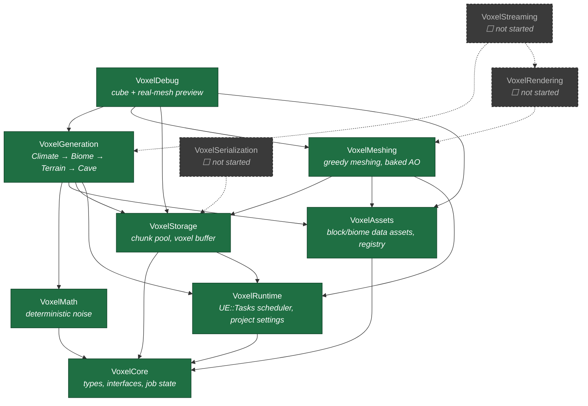
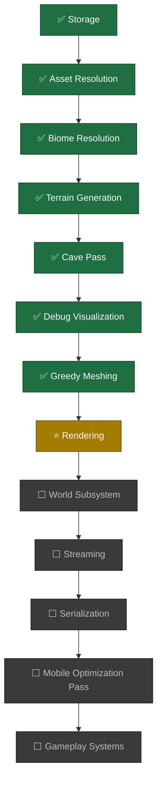

# Voxel Framework

**A modular, data-driven voxel world framework for Unreal Engine 5.7 — built as an engine subsystem, not a game.**

Deterministic generation, cache-friendly storage, greedy-meshed geometry, and a clean module boundary at every layer, designed from day one for mid-range Android/iOS as a first-class target rather than an afterthought.

---

## Status

> 🚧 **In active development.** Data pipeline (storage → assets → generation) and meshing are complete and test-covered, with visual validation done via the debug tool. Rendering has not started yet — see [Roadmap](#roadmap).

| Layer | Status |
|---|---|
| Storage | ✅ Complete, tested |
| Assets (blocks/biomes) | ✅ Complete, tested |
| Generation pipeline | ✅ Climate → Biome → Terrain → Cave, tested |
| Debug visualization | ✅ Complete — cube preview + real-mesh preview |
| Meshing | ✅ Complete, tested, visually validated |
| Rendering | ⬜ Not started |
| Streaming | ⬜ Not started |
| Serialization | ⬜ Not started |

A **World/Game Design checkpoint** is open regarding Region/Island systems (finite island, regions, handcrafted reservations) — see [`Docs/ARCHITECTURE.md`](Docs/ARCHITECTURE.md) §8. This does not block `VoxelRendering`, which is unaffected by that direction, same as `VoxelMeshing` was.

---

## Why this exists

Most voxel plugins for Unreal are built the way a hobbyist builds Minecraft: one Actor per chunk, `ProceduralMeshComponent`, tick-heavy streaming, and generation logic tangled directly into rendering code. That works for a weekend prototype and falls over the moment you need mobile performance, multiple biomes, or a second programmer to touch the code.

This framework is built the way Epic would ship a Landscape-adjacent subsystem: strict module boundaries, no circular dependencies, deterministic generation, and every subsystem replaceable in isolation.

---

## Architecture

### Module dependency graph



Dashed arrows/nodes are planned but not yet implemented. No arrow ever points backward. `VoxelMeshing` depends on `VoxelStorage`/`VoxelAssets`/`VoxelRuntime` only — no knowledge of biomes, regions, or generation logic, exactly per ADR-004.

### Generation → meshing pipeline


Every generation pass and the mesher itself are pure, worker-thread-safe functions with no `UObject` writes and no Game Thread requirement. Same seed and coordinate always produce an identical chunk and an identical mesh, both verified by hash/count-based automation tests.

---

## Architecture Decision Records

Frozen decisions — see [`Docs/ADR.md`](Docs/ADR.md) for full rationale. Summarized:

| ADR | Decision | Why |
|---|---|---|
| 001 | Chunks live in a `UWorldSubsystem`, never `AActor` | Actor/GC overhead is real cost for thousands of streamed chunks |
| 002 | Scheduling via `UE::Tasks`, not a custom thread pool | The engine already solves priority scheduling per-platform |
| 003 | `FVoxelChunk` is a plain C++ type, referenced by handle | Avoids GC pressure and allocation spikes on mobile |
| 004 | Meshing and Rendering are separate modules | Different lifetimes, different threading rules — confirmed correct by `VoxelMeshing`'s implementation |
| 005 | Serialization is diff-based, never whole-world | Mobile storage budgets; determinism from seed is free compression |

### Performance budgets (design constraints, not aspirations)

| System | Budget |
|---|---|
| Streaming (Game Thread) | ≤ 1.5 ms/frame |
| Generation | ≤ 2 ms/frame equivalent, budgeted across worker tasks |
| Meshing | Worker threads only, 0 ms Game Thread |
| Rendering submission | ≤ 1 ms/frame Game Thread |
| Serialization | Must never block Game Thread |

Measured so far: full `Climate + Biome + Terrain + Cave` pipeline for one 32³ chunk runs in **~0.4–1.2 ms** in-editor. Meshing that same chunk into greedy-merged geometry: **~1.1 ms**, producing ~2120 vertices / 1060 triangles / 3 material sections. Not yet profiled on-device.

---

## Module reference

| Module | Depends on | Responsibility |
|---|---|---|
| `VoxelCore` | — | Coordinates, handles, job state, interfaces. Leaf module, no owned systems. |
| `VoxelRuntime` | `VoxelCore` | `FVoxelScheduler` (wraps `UE::Tasks`), `UVoxelRuntimeSettings` (Project Settings). |
| `VoxelMath` | `VoxelCore` | Deterministic value noise + fBm. Pure functions only. |
| `VoxelAssets` | `VoxelCore` | `UVoxelBlockDefinition`, `UVoxelBiomeDefinition` data assets; `UVoxelBlockRegistry`. |
| `VoxelStorage` | `VoxelCore`, `VoxelRuntime` | `FVoxelChunk`, `FVoxelChunkStore`. |
| `VoxelGeneration` | `VoxelMath`, `VoxelAssets`, `VoxelStorage` | `IVoxelGenerationPass` pipeline: Climate → Biome → Terrain → Cave. |
| `VoxelMeshing` | `VoxelStorage`, `VoxelAssets`, `VoxelRuntime` | `FVoxelMesher` — greedy meshing, hidden-face removal, baked AO. `FVoxelMeshData` plain output, no rendering types. |
| `VoxelDebug` | `VoxelGeneration`, `VoxelMeshing`, `VoxelStorage`, `VoxelAssets` | `AVoxelDebugVisualizer` — cube-per-voxel preview AND real-mesh preview via `UProceduralMeshComponent` (explicit ADR-004 debug-only exception). |

---

## Testing

Every subsystem ships with automation tests (`WITH_DEV_AUTOMATION_TESTS`), runnable via **Window → Test Automation** or:

```
UnrealEditor-Cmd.exe "YourProject.uproject" -ExecCmds="Automation RunTests Voxel; Quit" -unattended -nullrhi
```

| Suite | Covers |
|---|---|
| `Voxel.Storage.CreateStoreModifyQuery` | Pooled chunk lifecycle, generation-write vs. gameplay-edit diff tracking, stale-handle rejection |
| `Voxel.Assets.BiomeLayerResolution` | Soft-pointer biome layer resolution to concrete block IDs |
| `Voxel.Generation.DeterministicFromSeed` | Same seed + coordinate ⇒ identical chunk |
| `Voxel.Generation.TerrainRespectsBiomeLayers` | Terrain places the *resolved* biome block, not a placeholder |
| `Voxel.Generation.Cave.DeterministicHash` | Full-chunk CRC32 stability across regeneration |
| `Voxel.Generation.Cave.AirRatioLogged` | Sanity-bounded air ratio, logged for visibility |
| `Voxel.Generation.Cave.SurfaceProtected` | Near-surface voxels never carved open |
| `Voxel.Generation.Cave.BoundaryContinuity` | Adjacent chunks show correlated terrain across the seam |
| `Voxel.Generation.PerfLog` | Logs full-pipeline generation time per chunk |
| `Voxel.Meshing.EmptyChunk` | All-air chunk produces no geometry |
| `Voxel.Meshing.SingleVoxel` | Isolated voxel: exact 24 verts / 36 indices / 12 tris |
| `Voxel.Meshing.AdjacentVoxelsMergeSameMaterial` | Proves greedy merging: 6 quads, not the unmerged 10 |
| `Voxel.Meshing.MaterialBoundaryPreventsMerge` | Hidden-face removal without cross-material merge: 40v/20tri/2 sections |
| `Voxel.Meshing.AmbientOcclusionVariesByProximity` | Near-occluder corner strictly darker than open corner, exact values verified |
| `Voxel.Meshing.DeterministicOutput` | Same chunk meshed twice ⇒ identical vertex data |
| `Voxel.Meshing.PerfLog` | Logs meshing time, vertex/triangle counts |

**All 16 tests passing** as of the current build.

---

## Roadmap



**Next up:** `VoxelRendering` — replaces the debug tool's `UProceduralMeshComponent` with a real custom `FPrimitiveSceneProxy`-based renderer per ADR-004, adding frustum culling, LOD, texture atlasing, and async GPU upload.

---

## Getting started

1. Copy `VoxelFramework/` into your project's `Plugins/` directory
2. Regenerate project files (new modules require this)
3. Build (`Development Editor`, Win64/Android/iOS)
4. Enable the plugin in **Edit → Plugins** if not already active — also ensure the engine's **Procedural Mesh Component** plugin is enabled (used by `VoxelDebug`'s mesh preview mode only, not by production code)
5. To preview generated terrain: place an `AVoxelDebugVisualizer` in a level, configure seed/chunk range in its Details panel, click **Generate And Visualize** (cubes) or **Generate And Visualize Meshed** (real greedy-meshed geometry)

Requires **Unreal Engine 5.7**.

---

## Project structure

```
VoxelFramework/
├── VoxelFramework.uplugin
├── Docs/
│   ├── ADR.md               # Full architecture decision records
│   ├── ARCHITECTURE.md      # In-depth internals + design checkpoint
│   └── API_REFERENCE.md     # Every public class/struct/function
├── TODO.md
└── Source/
    ├── VoxelCore/
    ├── VoxelRuntime/
    ├── VoxelMath/
    ├── VoxelAssets/
    ├── VoxelStorage/
    ├── VoxelGeneration/
    │   └── Passes/           # ClimatePass, BiomePass, TerrainPass, CavePass
    ├── VoxelMeshing/
    └── VoxelDebug/
```

---

## License

Not yet decided — TBD before any public release.
