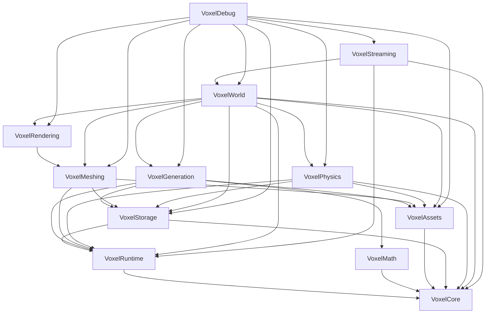

# Voxel Framework

A high-performance, modular, production-ready voxel engine plugin for Unreal Engine 5.7.

## Plugin Metadata
- **Name:** Voxel Framework
- **Version:** 2.3.0 (Production Runtime with VoxelPhysics V1)
- **Engine:** Unreal Engine 5.7
- **Author:** Jaimin
- **Architecture:** 12 independent, strictly decoupled modules

## Module Status

| Layer | Status | Description |
|---|---|---|
| **VoxelCore** | ✅ Complete | Leaf value types, coordinate math, handles, and job interfaces |
| **VoxelRuntime** | ✅ Complete | UE::Tasks asynchronous scheduler wrapper with terminal completion & bounded history |
| **VoxelMath** | ✅ Complete | Deterministic 2D/3D FastNoise SIMD gradient & FBM noise generators |
| **VoxelAssets** | ✅ Complete | Block definitions, biome layers, and runtime block registry |
| **VoxelStorage** | ✅ Complete | Compact 16-bit voxel storage, pooled chunk stores, and worker lease lifecycles |
| **VoxelGeneration** | ✅ Complete | 4-pass reentrant pipeline: Climate → Biome → Terrain → 3D Caves |
| **VoxelMeshing** | ✅ Complete | Greedy mesher + baked AO + 36-byte vertex format + neighbor boundary culling |
| **VoxelRendering** | ✅ Complete | Custom `UVoxelMeshComponent` & `FVoxelMeshSceneProxy` with $O(1)$ bounds |
| **VoxelPhysics** | ✅ Complete | Worker collision builder, `UVoxelCollisionComponent`, Chaos async cooking |
| **VoxelWorld** | ✅ Complete | Async world subsystem, component pooling, neighbor leasing, shutdown barrier |
| **VoxelStreaming** | ✅ Complete | 4-band distance manager, precomputed offsets, single-pass evaluation, adaptive budget |
| **VoxelDebug** | ✅ Complete | 5 visual preview modes + 10 Hz real-time performance telemetry HUD |
| **Serialization** | ⏸️ Decision Checkpoint | Optional terrain diff saving; skipped for v1 if world regenerates deterministically |

## Modules & Dependencies



## Architectural Highlights & Invariants

1. **Strict Plugin / Game Boundary**: VoxelFramework is a generic, reusable plugin technology. Game-specific storylines, handcrafted landmark reservations, and quests live outside the plugin and consume it.
2. **Dedicated Physical Collision Architecture (ADR-006)**: Visual geometry (`UVoxelMeshComponent`, up to `RenderDistance=14`) and physical collision geometry (`UVoxelCollisionComponent`, up to `SimulationDistance=4`) are strictly decoupled. Distant chunks render without paying memory or cooking costs for unused physics bodies.
3. **Immutable Collision Snapshot Model**: Worker threads generate plain CPU-side `FVoxelCollisionData` snapshots under active worker read leases. Unreal's Chaos physics engine cooks triangle collision asynchronously off the Game Thread via `IInterface_CollisionDataProvider`.
4. **Scheduler Terminal Completion & Bounded History**: Every submitted job has exactly one terminal completion path. `OnComplete` (and external lease cleanup) is guaranteed to execute across all job lifecycles.
5. **World Shutdown Barrier**: `UVoxelWorldSubsystem::Deinitialize` waits on all in-flight worker tasks (`WaitForAllTasks`) before resetting storage, preventing memory corruption or crashes on shutdown.
6. **Neighbor Lifetime Safety & Boundary Culling**: Meshing and collision acquire worker leases on all cardinal neighbors and only read `Ready` neighbors (treating unready/generating/unloaded neighbors as air), preventing concurrent read/write and use-after-free.
7. **Component Pool Stale Protection**: Stale in-flight completions arriving for unloaded chunks are safely discarded and cannot overwrite newly reassigned components.
8. **Compact 36-Byte Vertices**: `FVoxelMeshVertex` utilizes single-precision `FVector3f`, `FVector2f`, and `FColor` (36 bytes vs 80-byte double-precision legacy), slashing GPU bandwidth and cache footprint by ~55%.
9. **Precomputed Relative Offsets & Single-Pass Streaming**: `UVoxelStreamingManager` translates pre-sorted relative offsets in $O(N)$ with 0 heap allocations and 0 runtime sorting on chunk crossings, performing unloads, visibility, and collision simulation in a single unified pass.
10. **Adaptive Streaming Budget**: Automatically scales down streaming slice on warm/hot frames to protect 60/30 FPS frame pacing on mobile hardware.

## Testing (45 Passing Automation Tests)

The plugin leverages Unreal's Automation Testing framework with 45 passing tests ensuring complete subsystem integrity:

| Suite | Module | Covers |
|---|---|---|
| `Voxel.Assets.BiomeLayerResolution` | VoxelAssets | Soft-pointer biome layer resolution & caching |
| `Voxel.Generation.Cave.AirRatioLogged` | VoxelGeneration | Bounded air carving ratios |
| `Voxel.Generation.Cave.BoundaryContinuity` | VoxelGeneration | Cross-chunk continuous cave seams (>75% correlation) |
| `Voxel.Generation.Cave.DeterministicHash` | VoxelGeneration | Hash reproducibility |
| `Voxel.Generation.Cave.SurfaceProtected` | VoxelGeneration | Prevents cave carving on surface grass layers |
| `Voxel.Generation.DeterministicFromSeed` | VoxelGeneration | Seed determinism |
| `Voxel.Generation.PerfLog` | VoxelGeneration | Pipeline generation timing |
| `Voxel.Generation.TerrainRespectsBiomeLayers` | VoxelGeneration | Material layering |
| `Voxel.Meshing.AdjacentVoxelsMergeSameMaterial` | VoxelMeshing | Greedy quad merging |
| `Voxel.Meshing.AmbientOcclusionVariesByProximity` | VoxelMeshing | Corner AO darkening verified |
| `Voxel.Meshing.DeterministicOutput` | VoxelMeshing | Bit-exact remeshing output |
| `Voxel.Meshing.EmptyChunk` | VoxelMeshing | $O(1)$ all-air chunk fast-path |
| `Voxel.Meshing.MaterialBoundaryPreventsMerge` | VoxelMeshing | Multi-material boundary separation |
| `Voxel.Meshing.NeighborBoundaryCulling` | VoxelMeshing | 36-byte vertex layout & cross-chunk boundary quad culling |
| `Voxel.Meshing.PerfLog` | VoxelMeshing | Meshing timing |
| `Voxel.Meshing.SingleVoxel` | VoxelMeshing | Unit cube geometry validation |
| `Voxel.Physics.Cave` | VoxelPhysics | Subterranean cave collision geometry & internal face emission |
| `Voxel.Physics.CookFailure` | VoxelPhysics | Empty data / cook failure handling & delegate notification |
| `Voxel.Physics.Deterministic` | VoxelPhysics | Bit-exact reproducible collision vertices and indices |
| `Voxel.Physics.EmptyChunk` | VoxelPhysics | Fast-path for all-air chunks (0 vertices, 0 triangles) |
| `Voxel.Physics.FlatSurface` | VoxelPhysics | Greedy quad merging on terrain collision (observed >80% triangle reduction) |
| `Voxel.Physics.MissingNeighbor` | VoxelPhysics | Graceful fallback to air on missing/null neighbors |
| `Voxel.Physics.NeighborArrivalDuringCook` | VoxelPhysics | Neighbor arrival during build culls boundary faces safely |
| `Voxel.Physics.NeighborBoundary` | VoxelPhysics | Cross-chunk shared boundary collision face culling |
| `Voxel.Physics.NeighborUnloadDuringCook` | VoxelPhysics | Worker lease protection prevents neighbor memory recycling during build |
| `Voxel.Physics.NonCollidableFilter` | VoxelPhysics | Filtering blocks where `bGeneratesCollision = false` |
| `Voxel.Physics.OutwardWindingNormals` | VoxelPhysics | Winding order verification ensuring floor normals point UP (+Z) |
| `Voxel.Physics.SingleVoxel` | VoxelPhysics | Unit cube 6-quad collision shape and analytical bounds |
| `Voxel.Physics.Slope` | VoxelPhysics | Stepped slope collision geometry and multi-quad bounds |
| `Voxel.Physics.StaleRevision` | VoxelPhysics | Revision counter stale cook rejection and component lifecycle |
| `Voxel.Physics.UnloadDuringCook` | VoxelPhysics | Abort and cleanup safety during in-flight async cook |
| `Voxel.Rendering.ComponentBookkeeping` | VoxelRendering | SetMeshData/ClearMeshData, bounds, proxy lifecycle |
| `Voxel.Storage.CreateStoreModifyQuery` | VoxelStorage | Chunk lifecycle, handle stale-rejection, gen-write vs gameplay-edit diff tracking |
| `Voxel.Streaming.BandClassification` | VoxelStreaming | Pure function distance classification |
| `Voxel.Streaming.CancellationStateTransition` | VoxelStreaming | Deterministic worker cancellation |
| `Voxel.Streaming.DesiredCoordinates` | VoxelStreaming | Z-clamped sorting & bounding |
| `Voxel.Streaming.DistancePriorityMapping` | VoxelStreaming | Scheduler priority mapping |
| `Voxel.Streaming.LongRunStress` | VoxelStreaming | 1,000-iteration boundary churn, slot stability & memory verification |
| `Voxel.Streaming.NeighborLifetimeSafety` | VoxelStreaming | Neighbor worker lease retention during unload and delayed recycling |
| `Voxel.Streaming.SchedulerBoundedHistory` | VoxelStreaming | 2,000-job historical bounded retention |
| `Voxel.Streaming.SchedulerTerminalCompletion` | VoxelStreaming | Terminal completion on queued, running, duplicate, and post-completion cancellations |
| `Voxel.Streaming.SpawnChunkCollisionWithoutMovement` | VoxelStreaming | Immediate collision request for initial spawn chunk without requiring movement |
| `Voxel.Streaming.StateMachineTransitions` | VoxelStreaming | Authoritative chunk state machine |
| `Voxel.Streaming.StorageWorkerLeaseLifecycle` | VoxelStreaming | Safe async chunk leasing without use-after-free |
| `Voxel.World.RequestUnloadBookkeeping` | VoxelWorld | Subsystem request/unload idempotency |

### VoxelDebug Visualizer Modes
The `AVoxelDebugVisualizer` actor supports 5 CallInEditor modes for rapid in-editor validation and profiling:
1. **ApplyModeA_Baseline:** Disables voxel rendering and streaming to measure pure engine baseline.
2. **ApplyModeB_VoxelRenderingOn:** Standard voxel generation + meshing + rendering + streaming.
3. **ApplyModeC_CpuOnly:** CPU-only generation and meshing isolation (render components and GPU work bypassed).
4. **ApplyModeD_StaticWorld:** Static world (streaming updates frozen) to isolate steady-state rendering and draw calls.
5. **ApplyModeE_StreamingStress:** Streaming stress testing under rapid traversal.

Includes a **10 Hz live telemetry overlay** reporting instant/min/max FPS, P95/P99 frame pacing, thread breakdowns (Game, Render, GPU), queue latencies, component pool metrics, and mobile target compliance.

## Project Structure
```text
VoxelFramework/
├── VoxelFramework.uplugin
├── README.md
├── Docs/
│   ├── ADR.md
│   ├── ARCHITECTURE.md
│   ├── API_REFERENCE.md
│   └── TODO.md
└── Source/
    ├── VoxelCore/
    ├── VoxelRuntime/
    ├── VoxelMath/
    ├── VoxelAssets/
    ├── VoxelStorage/
    ├── VoxelGeneration/
    │   └── Passes/
    ├── VoxelMeshing/
    ├── VoxelRendering/
    ├── VoxelWorld/
    ├── VoxelStreaming/
    └── VoxelDebug/
```

## Roadmap

Storage ✅ → Assets ✅ → Biomes ✅ → Terrain ✅ → Caves ✅ → Meshing ✅ → Rendering ✅ → World Subsystem ✅ → Streaming ✅ → **Release Hardening & Low-Level Runtime Freeze ✅** → Gameplay Systems

## Getting Started

1. Copy `VoxelFramework/` into your project's `Plugins/` folder.
2. Regenerate project files for your `.uproject`.
3. Build your project (Development Editor, Win64/Android/iOS supported).
4. Enable the **Voxel Framework** plugin in the editor.
5. Place an `AVoxelDebugVisualizer` actor in your scene to inspect generation, meshing, or run live benchmarks.

## Configuration

Two Project Settings panels are provided under Plugins:
1. **Voxel Framework** (`UVoxelRuntimeSettings`): Adjust ChunkSize, WorldHeightInChunks, streaming distances, generation budgets, and memory budgets.
2. **Voxel World** (`UVoxelWorldSettings`): Define WorldSeed, DefaultBiomes, VoxelWorldSize, BlockMaterials, and DefaultMaterial.

## License
TBD — Internal Development / Pre-release.
