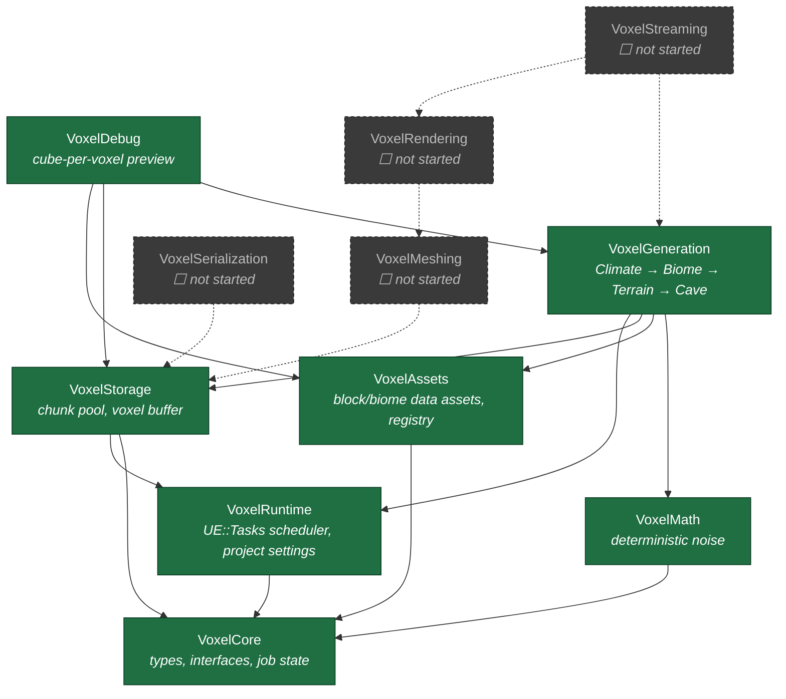
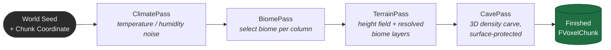
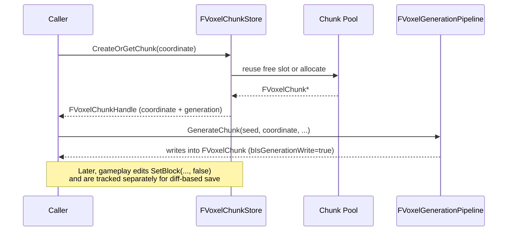
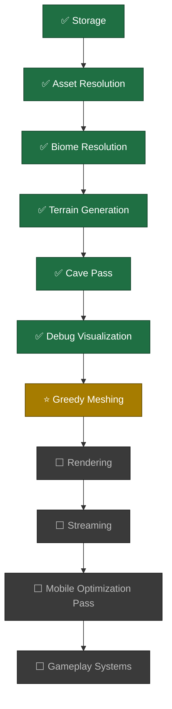

# Voxel Framework

**A modular, data-driven voxel world framework for Unreal Engine 5.7 — built as an engine subsystem, not a game.**

Deterministic generation, cache-friendly storage, and a clean module boundary at every layer, designed from day one for mid-range Android/iOS as a first-class target rather than an afterthought.

---

## Status

> 🚧 **In active development.** Data pipeline (storage → assets → generation) is complete and test-covered. Meshing/rendering has not started yet — see [Roadmap](#roadmap).

| Layer | Status |
|---|---|
| Storage | ✅ Complete, tested |
| Assets (blocks/biomes) | ✅ Complete, tested |
| Generation pipeline | ✅ Climate → Biome → Terrain → Cave, tested |
| Debug visualization | ✅ Complete |
| Meshing | ⬜ Not started |
| Rendering | ⬜ Not started |
| Streaming | ⬜ Not started |
| Serialization | ⬜ Not started |

---

## Why this exists

Most voxel plugins for Unreal are built the way a hobbyist builds Minecraft: one Actor per chunk, `ProceduralMeshComponent`, tick-heavy streaming, and generation logic tangled directly into rendering code. That works for a weekend prototype and falls over the moment you need mobile performance, multiple biomes, or a second programmer to touch the code.

This framework is built the way Epic would ship a Landscape-adjacent subsystem: strict module boundaries, no circular dependencies, deterministic generation, and every subsystem replaceable in isolation.

---

## Architecture

### Module dependency graph



Dashed arrows/nodes are planned but not yet implemented. No arrow ever points backward — `VoxelStorage` has no idea `VoxelGeneration` exists, `VoxelMath` has no idea `VoxelStorage` exists. Each module answers exactly one question.

### Generation pipeline



Every pass is a pure, worker-thread-safe function of `(seed, world coordinates)` — no `UObject` access, no Game Thread calls, no shared mutable state. Same seed and coordinate always produce an identical chunk, verified by hash-based automation tests.

### Chunk lifecycle



Handles carry a generation counter, so a handle captured before a chunk was unloaded and its pool slot reused is detectably stale instead of silently pointing at the wrong data.

---

## Architecture Decision Records

Frozen decisions — see [`Docs/ADR.md`](Docs/ADR.md) for full rationale. Summarized:

| ADR | Decision | Why |
|---|---|---|
| 001 | Chunks live in a `UWorldSubsystem`, never as `AActor` | Actor/GC overhead is real cost for thousands of streamed chunks |
| 002 | Scheduling via `UE::Tasks`, not a custom thread pool | The engine already solves priority scheduling per-platform |
| 003 | `FVoxelChunk` is a plain C++ type, referenced by handle | Avoids GC pressure and allocation spikes on mobile |
| 004 | Meshing and Rendering are separate modules | Different lifetimes, different threading rules |
| 005 | Serialization is diff-based, never whole-world | Mobile storage budgets; determinism from seed is free compression |

### Performance budgets (design constraints, not aspirations)

| System | Budget |
|---|---|
| Streaming (Game Thread) | ≤ 1.5 ms/frame |
| Generation | ≤ 2 ms/frame equivalent, budgeted across worker tasks |
| Meshing | Worker threads only, 0 ms Game Thread |
| Rendering submission | ≤ 1 ms/frame Game Thread |
| Serialization | Must never block Game Thread |

Measured so far: full `Climate + Biome + Terrain + Cave` pipeline for one 32³ chunk runs in **~0.4–0.6 ms** in-editor (Development build, not yet profiled on-device).

---

## Module reference

| Module | Depends on | Responsibility |
|---|---|---|
| `VoxelCore` | — | Coordinates, handles, job state, interfaces. Leaf module, no owned systems. |
| `VoxelRuntime` | `VoxelCore` | `FVoxelScheduler` (wraps `UE::Tasks`), `UVoxelRuntimeSettings` (Project Settings: chunk size, streaming distances, budgets). |
| `VoxelMath` | `VoxelCore` | Deterministic value noise + fBm. Pure functions only. |
| `VoxelAssets` | `VoxelCore` | `UVoxelBlockDefinition`, `UVoxelBiomeDefinition` data assets; `UVoxelBlockRegistry` resolves block/biome references to fast runtime IDs. |
| `VoxelStorage` | `VoxelCore`, `VoxelRuntime` | `FVoxelChunk` (dense voxel buffer + modification diff), `FVoxelChunkStore` (pooled, handle-based chunk lifecycle). |
| `VoxelGeneration` | `VoxelMath`, `VoxelAssets`, `VoxelStorage` | `IVoxelGenerationPass` pipeline: Climate → Biome → Terrain → Cave. |
| `VoxelDebug` | `VoxelGeneration`, `VoxelStorage`, `VoxelAssets` | `AVoxelDebugVisualizer` — cube-per-visible-voxel preview for validating generation before investing in real meshing. |

---

## Testing

Every subsystem ships with automation tests (`WITH_DEV_AUTOMATION_TESTS`), runnable via **Window → Test Automation** or:

```
UnrealEditor-Cmd.exe "YourProject.uproject" -ExecCmds="Automation RunTests Voxel; Quit" -unattended -nullrhi
```

| Suite | Covers |
|---|---|
| `Voxel.Storage.CreateStoreModifyQuery` | Pooled chunk lifecycle, generation-write vs. gameplay-edit diff tracking, stale-handle rejection |
| `Voxel.Assets.BiomeLayerResolution` | Soft-pointer biome layer resolution to concrete block IDs |
| `Voxel.Generation.DeterministicFromSeed` | Same seed + coordinate ⇒ identical chunk |
| `Voxel.Generation.TerrainRespectsBiomeLayers` | Terrain places the *resolved* biome block, not a placeholder |
| `Voxel.Generation.Cave.DeterministicHash` | Full-chunk CRC32 stability across regeneration |
| `Voxel.Generation.Cave.AirRatioLogged` | Sanity-bounded air ratio, logged for visibility |
| `Voxel.Generation.Cave.SurfaceProtected` | Near-surface voxels never carved open |
| `Voxel.Generation.Cave.BoundaryContinuity` | Adjacent chunks show correlated terrain across the seam (catches chunk-local noise regressions) |
| `Voxel.Generation.PerfLog` | Logs full-pipeline generation time per chunk |

**All 9 tests passing** as of the current build.

---

## Roadmap



**Next up:** production greedy meshing (`VoxelMeshing`) — merges coplanar faces instead of emitting one cube per voxel, targets mobile draw-call budgets, runs entirely on worker threads and hands off plain vertex/index arrays to `VoxelRendering`.

---

## Getting started

1. Copy `VoxelFramework/` into your project's `Plugins/` directory
2. Regenerate project files (new modules require this)
3. Build (`Development Editor`, Win64/Android/iOS)
4. Enable the plugin in **Edit → Plugins** if not already active
5. To preview generated terrain: place an `AVoxelDebugVisualizer` in a level, configure seed/chunk range in its Details panel, click **Generate And Visualize**

Requires **Unreal Engine 5.7**.

---

## Project structure

```
VoxelFramework/
├── VoxelFramework.uplugin
├── Docs/
│   └── ADR.md              # Full architecture decision records
└── Source/
    ├── VoxelCore/
    ├── VoxelRuntime/
    ├── VoxelMath/
    ├── VoxelAssets/
    ├── VoxelStorage/
    ├── VoxelGeneration/
    │   └── Passes/          # ClimatePass, BiomePass, TerrainPass, CavePass
    └── VoxelDebug/
```

---

## License

Not yet decided — TBD before any public release.
