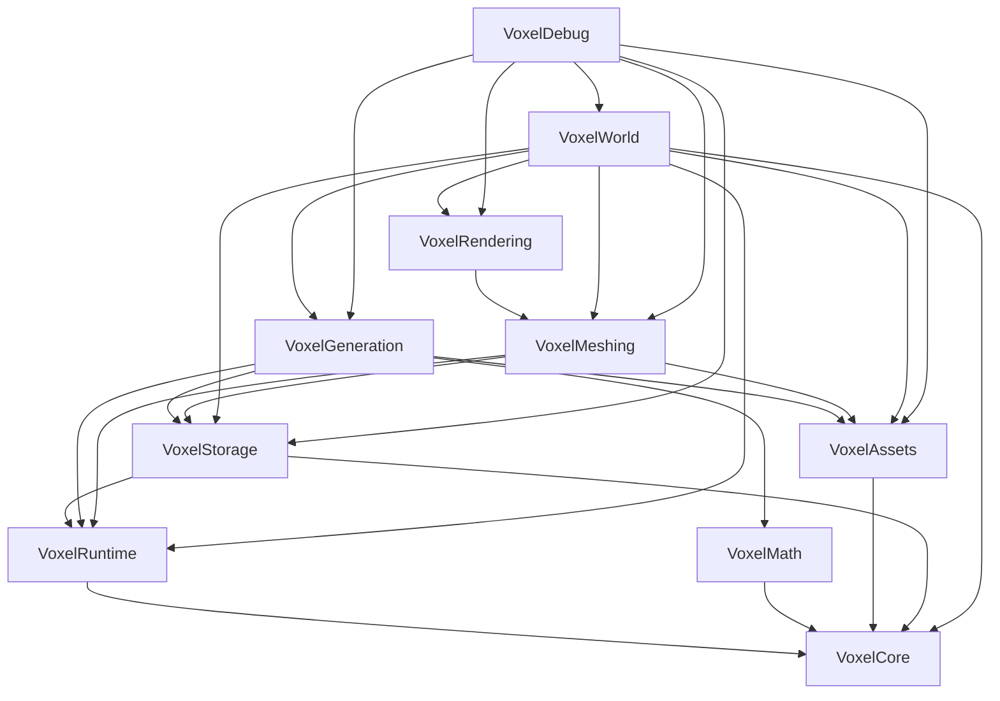
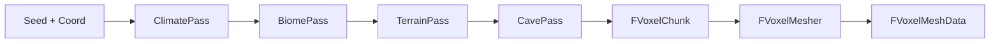
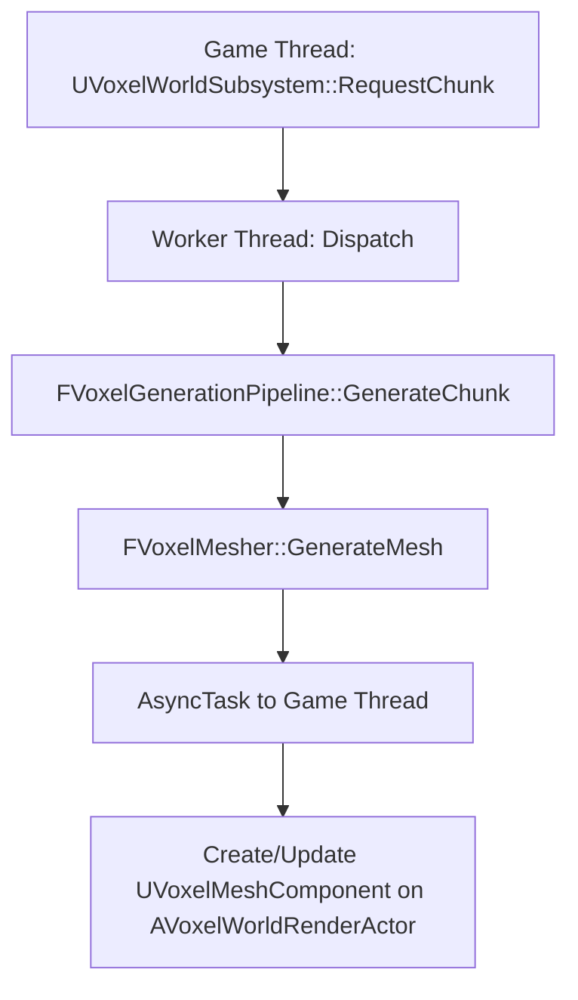
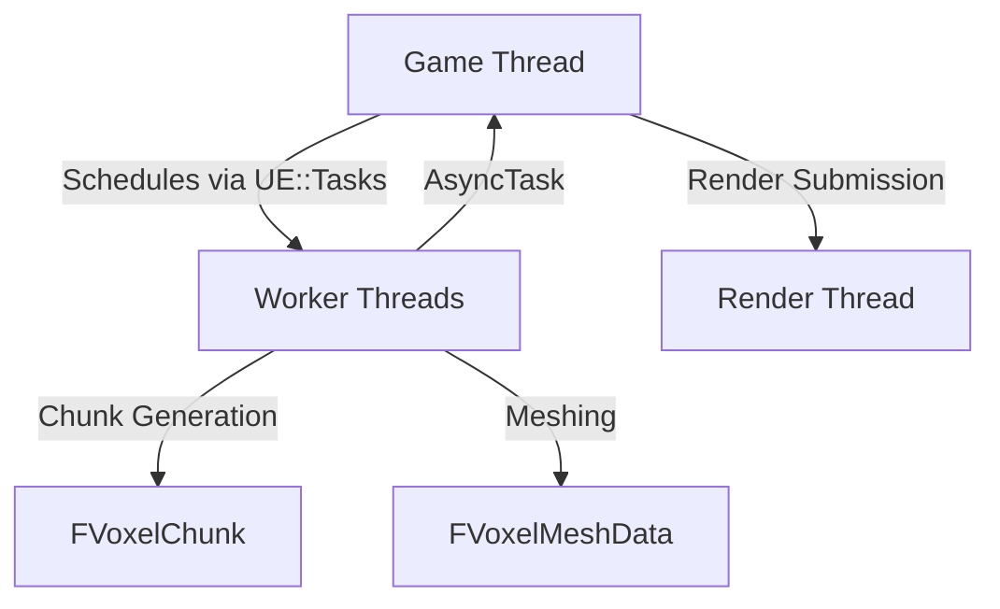

# Voxel Framework

A high-performance, modular voxel engine plugin for Unreal Engine.

## Plugin Metadata
- **Name:** Voxel Framework
- **Version:** 2.0.0 (Beta)
- **Engine:** Unreal Engine 5.7
- **Author:** Jaimin
- **Architecture:** 10 independent, decoupled modules

## Status

| Layer | Status |
|---|---|
| **VoxelCore** (types, interfaces) | ✅ Complete |
| **VoxelRuntime** (scheduler, settings) | ✅ Complete |
| **VoxelMath** (noise) | ✅ Complete |
| **VoxelAssets** (blocks, biomes, registry) | ✅ Complete, tested |
| **VoxelStorage** (chunk pool, voxel data) | ✅ Complete, tested |
| **VoxelGeneration** (Climate→Biome→Terrain→Cave) | ✅ Complete, tested |
| **VoxelMeshing** (greedy mesh, AO) | ✅ Complete, tested, visually validated |
| **VoxelRendering** (custom scene proxy) | ✅ Complete, tested |
| **VoxelWorld** (async subsystem) | ✅ Complete, tested, visually validated |
| **VoxelDebug** (5 preview modes) | ✅ Complete |
| **Streaming** | ⬜ Not started |
| **Serialization** | ⬜ Not started |

## Modules & Dependencies

The plugin is strictly layered to prevent cyclic dependencies and enforce separation of concerns.

| Module | Dependencies | Description |
|---|---|---|
| **VoxelCore** | None | Leaf module. Defines `FVoxelBlockId`, `FVoxelChunkCoordinate`, `FVoxelChunkHandle`, `EVoxelJobState`, `FVoxelJobHandle`. |
| **VoxelRuntime** | VoxelCore | Houses `FVoxelScheduler` (UE::Tasks wrapper) and `UVoxelRuntimeSettings` (Project Settings). |
| **VoxelMath** | VoxelCore | Contains `VoxelNoise` namespace for `Sample2D/3D`, `FBM2D/3D`. |
| **VoxelAssets** | VoxelCore | Defines `UVoxelBlockDefinition`, `UVoxelBiomeDefinition` (UDataAssets), and `UVoxelBlockRegistry` (UWorldSubsystem). |
| **VoxelStorage** | VoxelCore, VoxelRuntime | Manages `FVoxelChunk` (plain C++) and `FVoxelChunkStore` (pooled lifecycle). |
| **VoxelGeneration**| VoxelMath, VoxelAssets, VoxelStorage, VoxelRuntime | Implements `FVoxelGenerationPipeline` across 4 passes: Climate, Biome, Terrain, Cave. |
| **VoxelMeshing** | VoxelStorage, VoxelAssets, VoxelRuntime | Provides `FVoxelMesher` (greedy meshing + AO), `FVoxelMeshData`, and `VoxelMeshingService`. |
| **VoxelRendering** | VoxelMeshing | Supplies `UVoxelMeshComponent` (UMeshComponent) and `FVoxelMeshSceneProxy` (FPrimitiveSceneProxy). |
| **VoxelWorld** | VoxelCore, VoxelRuntime, VoxelAssets, VoxelStorage, VoxelGeneration, VoxelMeshing, VoxelRendering | Defines `UVoxelWorldSubsystem` (UWorldSubsystem), `UVoxelWorldSettings`, and `AVoxelWorldRenderActor`. |
| **VoxelDebug** | VoxelGeneration, VoxelMeshing, VoxelStorage, VoxelAssets, VoxelRendering, VoxelWorld | Provides `AVoxelDebugVisualizer` with 5 CallInEditor preview modes. |



## Pipelines

### 1. Generation Pipeline


### 2. Async World Pipeline


### 3. Threading Model


## Architecture Decision Records (ADRs)
We maintain a set of frozen ADRs reflecting foundational design decisions.
- **ADR-001:** Chunks are kept in a `UWorldSubsystem`, never as `AActor`s.
- **ADR-002:** Scheduling utilizes `UE::Tasks` natively, no custom thread pool.
- **ADR-003:** `FVoxelChunk` is plain C++, referenced globally via handle (coordinate + generation counter).
- **ADR-004:** Meshing and Rendering are strictly separated modules.
- **ADR-005:** Diff-based serialization ensures only modified voxels are saved.

> **Note:** See `ARCHITECTURE.md` §8 for the World/Game Design checkpoint and implementation nuances.

## Performance Budgets

| Metric | Budget | Current Measurement |
|---|---|---|
| **Streaming Game Thread** | ≤ 1.5ms / frame | N/A (Pending) |
| **Generation** | ≤ 2.0ms / frame (worker eq.) | ~0.4 - 1.2ms |
| **Meshing** | Worker threads only, 0ms GT | ~1.1ms for 32³ chunk (~2120 verts / 1060 tris / 3 sections) |
| **Render Submission** | ≤ 1.0ms Game Thread | Well within limits |
| **Serialization** | Non-blocking | N/A (Pending) |

## Testing

The plugin leverages Unreal's Automation Testing framework with 21 passing tests ensuring module integrity.

| Suite | Module | Covers |
|---|---|---|
| `Voxel.Storage.CreateStoreModifyQuery` | VoxelStorage | Chunk lifecycle, handle stale-rejection, gen-write vs gameplay-edit diff tracking |
| `Voxel.Assets.BiomeLayerResolution` | VoxelAssets | Soft-pointer biome layer resolution |
| `Voxel.Generation.DeterministicFromSeed` | VoxelGeneration | Same seed+coord → identical chunk |
| `Voxel.Generation.TerrainRespectsBiomeLayers` | VoxelGeneration | Terrain uses resolved biome blocks |
| `Voxel.Generation.Cave.DeterministicHash` | VoxelGeneration | CRC32 stability with caves |
| `Voxel.Generation.Cave.AirRatioLogged` | VoxelGeneration | Bounded air ratio |
| `Voxel.Generation.Cave.SurfaceProtected` | VoxelGeneration | No caves pierce surface |
| `Voxel.Generation.Cave.BoundaryContinuity` | VoxelGeneration | Cross-chunk seam correlation >75% |
| `Voxel.Generation.PerfLog` | VoxelGeneration | Pipeline timing |
| `Voxel.Meshing.EmptyChunk` | VoxelMeshing | All-air → no geometry |
| `Voxel.Meshing.SingleVoxel` | VoxelMeshing | 24 verts / 36 indices / 12 tris |
| `Voxel.Meshing.AdjacentVoxelsMergeSameMaterial` | VoxelMeshing | Greedy merge: 6 quads |
| `Voxel.Meshing.MaterialBoundaryPreventsMerge` | VoxelMeshing | No cross-material merge: 2 sections |
| `Voxel.Meshing.AmbientOcclusionVariesByProximity` | VoxelMeshing | Corner AO darkening verified |
| `Voxel.Meshing.DeterministicOutput` | VoxelMeshing | Identical mesh on re-mesh |
| `Voxel.Meshing.PerfLog` | VoxelMeshing | Meshing timing |
| `Voxel.Rendering.ComponentBookkeeping` | VoxelRendering | SetMeshData/ClearMeshData, bounds |
| `Voxel.World.RequestUnloadBookkeeping` | VoxelWorld | Request/Unload lifecycle, idempotency |

### VoxelDebug Visualizer Modes
The `AVoxelDebugVisualizer` actor supports 5 CallInEditor modes for rapid in-editor validation:
1. **GenerateAndVisualize:** Generates chunks and spawns a cube per visible voxel (using ISMC).
2. **GenerateAndVisualizeMeshed:** Uses real `FVoxelMesher` generating a `UProceduralMeshComponent`.
3. **GenerateAndVisualizeRendered:** Uses real `UVoxelMeshComponent` with `FVoxelMeshSceneProxy`.
4. **RequestChunksViaSubsystem:** Invokes the real async `UVoxelWorldSubsystem` pipeline (PIE only).
5. **ValidateSubsystemResults:** Performs per-chunk validation on subsystem results (with Output Log PASS/FAIL).

## Project Structure
```text
VoxelFramework/
├── VoxelFramework.uplugin
├── README.md
├── Docs/
│   ├── ADR.md
│   ├── ARCHITECTURE.md
│   ├── API_REFERENCE.md
│   └── TODO.md
└── Source/
    ├── VoxelCore/
    ├── VoxelRuntime/
    ├── VoxelMath/
    ├── VoxelAssets/
    ├── VoxelStorage/
    ├── VoxelGeneration/
    │   └── Passes/
    ├── VoxelMeshing/
    ├── VoxelRendering/
    ├── VoxelWorld/
    └── VoxelDebug/
```

## Roadmap

Storage ✅ → Assets ✅ → Biomes ✅ → Terrain ✅ → Caves ✅ → Debug Viz ✅ → Meshing ✅ → Rendering ✅ → World Subsystem ✅ → **Streaming (next)** → Serialization → Mobile Optimization → Gameplay Systems

## Getting Started

1. Copy `VoxelFramework/` into your project's `Plugins/` folder.
2. Regenerate project files for your `.uproject`.
3. Build your project (Development Editor, Win64/Android/iOS supported).
4. Enable the **Voxel Framework** plugin and the **ProceduralMeshComponent** plugin in the editor.
5. Place an `AVoxelDebugVisualizer` actor in your scene, configure the seed and chunk range, and use the exposed buttons.
6. For async pipeline testing: Play in PIE, click `RequestChunksViaSubsystem`, then `ValidateSubsystemResults`.

*Requires Unreal Engine 5.7.*

## Configuration

Two Project Settings panels are provided under Plugins:
1. **Voxel Framework** (`UVoxelRuntimeSettings`): Adjust ChunkSize, WorldHeightInChunks, streaming distances, generation budgets, and memory budgets.
2. **Voxel World** (`UVoxelWorldSettings`): Define WorldSeed, DefaultBiomes, VoxelWorldSize, BlockMaterials, and DefaultMaterial.

## License
Not yet decided — TBD before any public release.
